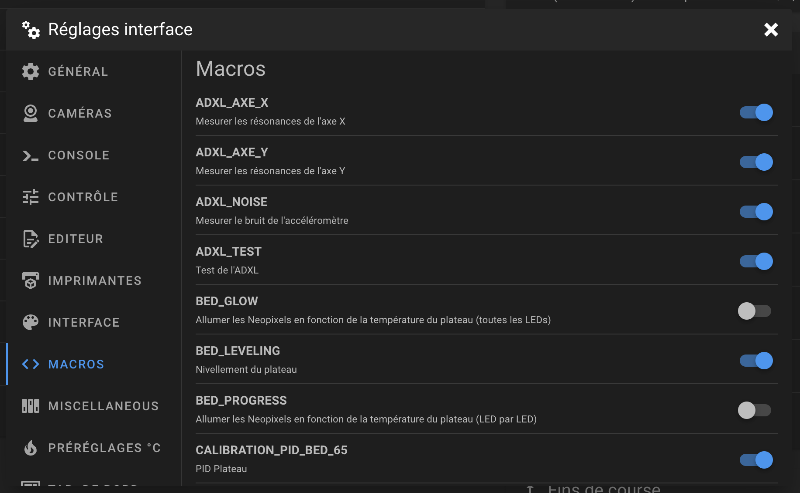

---
hide:
  - toc
---

# Explication des fichiers

## Fichiers de configurations :

- Fichier {==adxl_345.cfg==} : Contient les paramètres de l’accéléromètre.

- Fichier {==crowsnest.conf==} : Contient les paramètres relatif à la caméra (résolution, framerate etc…).

- Fichier {==KlipperScreen.conf==} : Contient les paramètres relatif à l’interface de l’écran.
     
- Fichier {==macros.cfg==} : Contient l’ensemble des macros utiles au fonctionnement de Klipper.

- Fichier {==moonraker.conf==} : Contient l’ensemble des paramètres relatif au fonctionnement de Klipper et de Mainsail.

- Fichier {==neopixels.cfg==} : Contient l’ensemble des macros utiles au fonctionnement des NeoPixels.

- Fichier {==printer.cfg==} : Contient l’ensemble des paramètres relatifs à l’imprimante.

- Fichier {==sonar.conf==} : Contient l’ensemble des paramètres relatifs au daemon Sonar utilisé par MainsailOS.

- Fichier {==timelapse.cfg==} : Contient l’ensemble des macros utiles au fonctionnement des Timelapses.

- Fichier {==variables.cfg==} : Contient la valeur du Gcode Offset sauvegardée.

## Macros :

- Macro {==START_PRINT==} : Contient le G-Code de démarrage.

{==

:octicons-info-16: Cette macro est uniquement destinée au fonctionnement de Klipper, elle ne doit pas être lancée par l’utilisateur et peut être masquée dans les paramètres de Mainsail.

==}

- Macro {==END_PRINT==} : Contient le G-Code de fin.

{==

:octicons-info-16: Cette macro est uniquement destinée au fonctionnement de Klipper, elle ne doit pas être lancée par l’utilisateur et peut être masquée dans les paramètres de Mainsail.

==}

- Macro {==PAUSE==} : Permet de mettre en pause l’impression en cours.

{==

:octicons-info-16: Cette macro peut être lancée par l’utilisateur.

==}

- Macro {==RESUME==} : Permet de reprendre l’impression mise en pause.

{==

:octicons-info-16: Cette macro peut être lancée par l’utilisateur.

==}

Macro {==CANCEL_PRINT==} : Permet d’annuler l’impression en cours.

{==

:octicons-info-16: Cette macro peut être lancée par l’utilisateur.

==}

- Macro {==M600==} : G-Code utilisé lors de la détection de fin de filament ou d’un M600 dans le G-Code pour un changement de couleur.

{==

:octicons-info-16: Cette macro est uniquement destinée au fonctionnement de Klipper, elle ne doit pas être lancée par l’utilisateur et peut être masquée dans les paramètres de Mainsail.

==}

- Macro {==UNLOAD_FILAMENT==} : Permet d’effectuer un retrait du filament de la hotend.

{==

:octicons-info-16: Cette macro peut être lancée par l’utilisateur.

==}

- Macro {==LOAD_FILAMENT==} : Permet d’effectuer un chargement de filament dans la hotend.

{==

:octicons-info-16: Cette macro peut être lancée par l’utilisateur.

==}

- Macro {==Z_OFFSET_CALIBRATION==} : Permet de définir le Z-Offset.

{==

:octicons-info-16: Cette macro peut être lancée par l’utilisateur.

==}

- Macro {==ENDSTOPS_CALIBRATION==} : Permet d’améliorer la précision des capteurs de fin de course.

{==

:octicons-info-16: Cette macro peut être lancée par l’utilisateur.

==}

- Macro {==DELTA_CALIBRATION==} : Permet d’effectuer une calibration Delta.

{==

:octicons-info-16: Cette macro peut être lancée par l’utilisateur.

==}

- Macro {==BED_LEVELING==} : Permet d’effectuer un nivellement du plateau.

{==

:octicons-info-16: Cette macro peut être lancée par l’utilisateur.

==}

- Macro {==PRESSURE_ADVANCE==} : Permet de lancer les commandes nécessaires au test de Pressure Advance.

{==

:octicons-info-16: Cette macro peut être lancée par l’utilisateur.

==}

- Macro {==CALIBRATION_PID_BED_65==} : Permet d’effectuer une calibration du PID du plateau à 65 C° par défaut. Il est possible de choisir la température de calibration en cliquant sur la flèche de la macro.

{==

:octicons-info-16: Cette macro peut être lancée par l’utilisateur.

==}

- Macro {==CALIBRATION_PID_HOTEND_220==}: Permet d’effectuer une calibration du PID de la buse à 220 C° par défaut. Il est possible de choisir la température de calibration en cliquant sur la flèche de la macro.

{==

:octicons-info-16: Cette macro peut être lancée par l’utilisateur.

==}

- Macro {==ADXL_TEST==} : Permet de tester la connexion de l’accéléromètre.

{==

:octicons-info-16: Cette macro peut être lancée par l’utilisateur.

==}

- Macro {==ADXL_NOISE==} : Permet de mesurer le bruit de chaque axe de l’accéléromètre.

{==

:octicons-info-16: Cette macro peut être lancée par l’utilisateur.

==}

- Macro {==ADXL_AXE_X==} : Permet de mesurer les résonances de l’axe X de l’imprimante.

{==

:octicons-info-16: Cette macro peut être lancée par l’utilisateur.

==}

- Macro {==ADXL_AXE_Y==} : Permet de mesurer les résonances de l’axe Y de l’imprimante.

{==

:octicons-info-16: Cette macro peut être lancée par l’utilisateur.

==}

- Macro {==SAUVEGARDER==} : Permet de sauvegarder les nouveaux paramètres dans le fichier printer.cfg.

{==

:octicons-info-16: Cette macro peut être lancée par l’utilisateur.

==}

- Macro {==M204==} : Permet de gérer le contrôle d'accélération si utilisé dans le Slicer.

{==

:octicons-info-16: Cette macro est uniquement destinée au fonctionnement de Klipper, elle ne doit pas être lancée par l’utilisateur et peut être masquée dans les paramètres de Mainsail.

==}

- Macro {==M205==} : Permet de gérer le contrôle de saccade si utilisé dans le Slicer.

{==

:octicons-info-16: Cette macro est uniquement destinée au fonctionnement de Klipper, elle ne doit pas être lancée par l’utilisateur et peut être masquée dans les paramètres de Mainsail.

==}

- Macro - Macro {==SECURITY_OFFSET==} : Permet d'appliquer un Offset de sécurité de 2 mm.

{==

:octicons-info-16: Cette macro peut être lancée par l’utilisateur.

==}

- Macro {==SET_GCODE_OFFSET==} : Permet de sauvegarder en arrière-plan de Gcode Offset.

{==

:octicons-info-16: Cette macro est uniquement destinée au fonctionnement de Klipper, elle ne doit pas être lancée par l’utilisateur et peut être masquée dans les paramètres de Mainsail.

==}

- Macro {==LOAD_GCODE_OFFSETS==} : Permet de charger le Gcode Offset au démarrage de Klipper.

{==

:octicons-info-16: Cette macro est uniquement destinée au fonctionnement de Klipper, elle ne doit pas être lancée par l’utilisateur et peut être masquée dans les paramètres de Mainsail.

==}

 

- Pour masquer une macro il suffit de vous rendre dans les **Paramètres** de Mainsail puis de la décocher depuis l'onglet **MACROS** :

{ width="600" }

 
