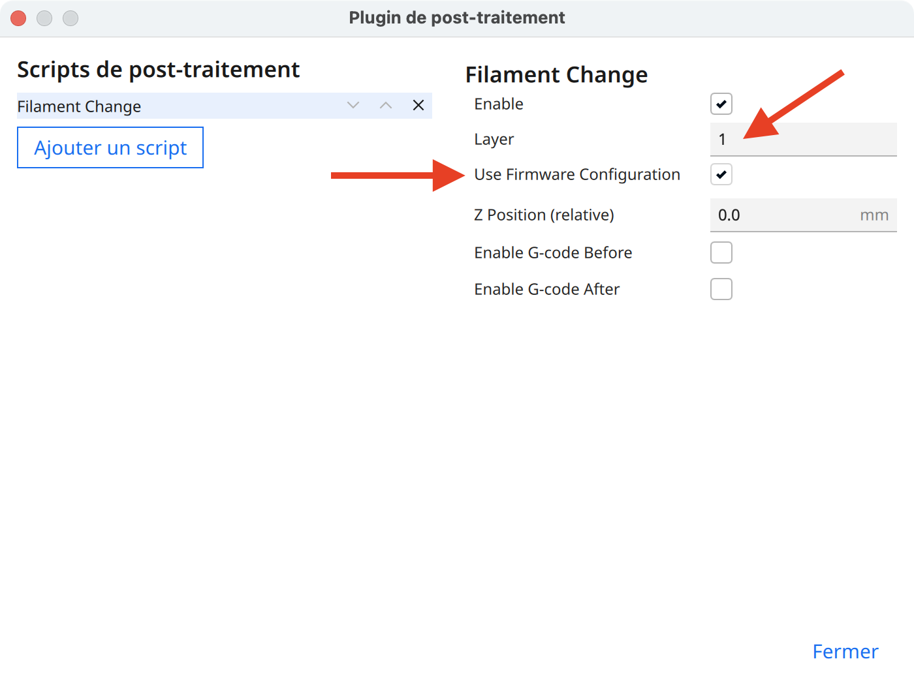
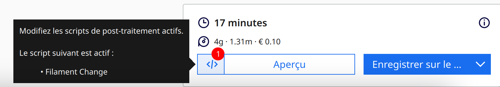

---
hide:
  - toc
---

# Utilisation de la fonction M600

La fonction M600 lance la procédure de changement de filament si elle est définit par l'utilisateur ou lors de la détection d'une fin de filament.
 

Cette fonction non native dans Klipper est cependant réalisable grâce aux macros.

 

## Processus de la fonction M600 :

  - Lors de la présence de la commande M600 dans le fichier Gcode ou lorsque le détecteur de fin de filament se déclenche, la macro M600 est alors chargée.
  - La hotend va alors se lever légérement et se parquer vers l'avant de l'imprimante.
  - L'extrudeur va ensuite extraire le filament de la hotend et couper la chauffe de la buse (afin d'éviter une chauffe en continue sans extrusion si vous n'êtes pas devant l'imprimante à ce moment). Seule la chauffe du plateau est maintenue pour éviter le décollement du modèle.
  - A partir de cet instant l'impriante reste en standby en attendand une action de l'utilisateur.
  - Il suffit ensuite de venir placer le nouveau filament à l'entrée de l'extrudeur (et non pas de l'insérer manuellement dans la hotend) et de reprendre l'impression.
  - La buse va alors reprendre sa chauffe à la température initale de l'impression.
  - Une fois la chauffe atteinte, l'extrudeur va alors charger le nouveau filamentpuis effectuer une purge de quelques centimètres.
  - L'impression est alors relancée.

 

## Utilisation de la fonction M600 dans Cura :

Pour insérer un changement de filament dans Cura, rendez-vous dans le menu :

**Extensions** :material-arrow-right: **Post-Traitement** :material-arrow-right: **Modifier le G-Code** :material-arrow-right: **Ajouter un script** :material-arrow-right: **Filament Change**.
 

Il faut alors définir la couche à laquelle vous souhaitez que le changement de filament se déclenche et il est important de cocher la case **Use Firmware Configuration** :

{ width="600" }

Vous verrez ensuite que le script de Post-Traitement est bien actif lors de la découpe du fichier :

{ width="600" }

 
