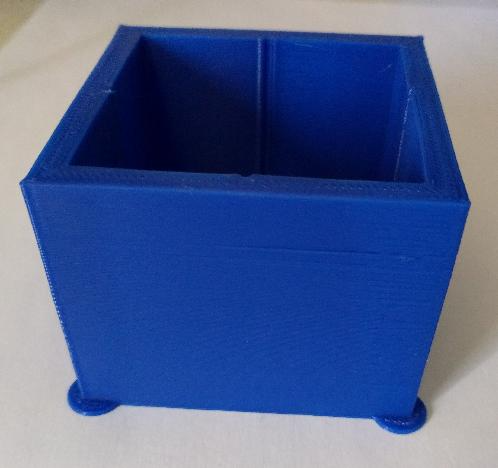
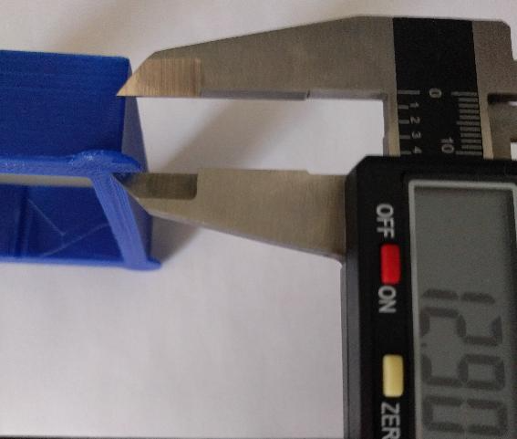

---
hide:
  - toc
---

# Pressure Advance

La fonctionnalité Pressure Advance fait deux choses utiles : elle réduit le suintement pendant les mouvements sans extrusion et elle réduit les bavures dans les virages.

Afin de calibrer le Pressure Advance, l'imprimante doit être configurée et opérationnelle car le test de réglage implique l'impression et l'inspection d'un objet de test. Il est conseillé de lire ce document dans son intégralité avant d'exécuter le test.

<br />

## Préparation au test :

 - Utilisez un slicer pour générer le Gcode de ce modèle : :material-download: <a href="https://www.klipper3d.org/prints/square_tower.stl" target="_blank">square_tower.stl</a>
 
    Utilisez une vitesse élevée (par exemple, 100 mm/s), un remplissage nul et une hauteur de couche grossière (la hauteur de couche doit être d'environ 75 % du diamètre de la buse). Assurez-vous que tout "contrôle d'accélération dynamique" est désactivé dans le slicer.

- Avant de démarrer l'impression, il est nécessaire de préparer Klipper au test de Pressure Advance. Pour cela, lancez la macro suivante :

``` yaml
PRESSURE_ADVANCE
```

{==

:octicons-info-16: Cette macro ralentit le déplacement de la buse dans les coins pour accentuer les effets de la pression de l'extrudeur.

==}

- Vous pouvez ensuite démarrer l'impression du modèle de test.

<br />

## Interprétation des résultats :

Une fois entièrement imprimé, le test d'impression ressemble à cela :

{ width="400" }

La commande TUNING_TOWER ci-dessus demande à Klipper de modifier le paramètre pressure_advance sur chaque couche de l'impression. Les couches supérieures de l'impression auront une valeur **pressure_advance** plus élevée. Les couches inférieures auront des bavures dans les coins, et les couches au-dessus du réglage idéal peuvent conduire à des coins arrondis et à une mauvaise extrusion menant au coin.

On peut annuler l'impression plus tôt si l'on constate que les coins ne s'impriment plus bien (et ainsi on peut éviter d'imprimer des couches dont on sait qu'elles sont au-dessus de la valeur idéale de **pressure_advance**).

Inspectez l'impression, puis utilisez un pied à coulisse numérique pour trouver la hauteur qui a les meilleurs coins de qualité. En cas de doute, préférez une hauteur inférieure :

{ width="400" }

- La valeur **pressure_advance** peut alors être calculée comme cela :

    {==START==} :fontawesome-solid-plus: {==hauteur_mesurée==} :fontawesome-solid-xmark: {==FACTOR==} :fontawesome-solid-arrow-right-long: {==pressure_advance==}
  
    Par exemple : 0 :fontawesome-solid-plus: 12.90 :fontawesome-solid-xmark: 0.005 :fontawesome-solid-arrow-right-long: 0.0645
    
    Pour les extrudeurs **Direct Drive** le **FACTOR = 0.005** et pour les extrudeurs **Bowden** le **FACTOR = 0.020**

{==

:octicons-info-16: Les valeurs **pressure_advance** typiques sont comprises entre 0.050 et 1.000 (une valeur haute est généralement constatée en Bowden).

==}

- Rendez-vous dans l'onglet **Machine** sur le menu latéral gauche, ouvrez le fichier **printer.cfg** et modifiez la ligne **pressure_advance** de la section **Paramètres Extrudeur & Driver** en y reportant votre valeur obtenue (retirez également les # pour activer la fonctionnalité) :

``` yaml hl_lines="19 20" title="printer.cfg"
########################################
# Paramètres Extrudeur & Driver
########################################

[extruder]
step_pin: PB3
dir_pin: !PB4
enable_pin: !PD5
microsteps: 16
rotation_distance: 5.7
full_steps_per_rotation: 200
nozzle_diameter: 0.400
filament_diameter: 1.750
heater_pin: PC8
sensor_type: ATC Semitec 104NT-4-R025H42G
sensor_pin: PA0
min_temp: -5
max_temp: 275
pressure_advance: 0.0645
pressure_advance_smooth_time: 0.01
max_extrude_only_distance: 800.0
instantaneous_corner_velocity: 2.5
```

- Cliquez sur **SAUVEGARDER ET REDÉMARRAGE** en haut à droite pour enregistrer le fichier.

<br />

Vous trouverez plus d'informations sur la documentation officielle : :material-web: <a href="https://www.klipper3d.org/Pressure_Advance.html" target="blank">Pressure Advance | Klipper</a>

<br />
