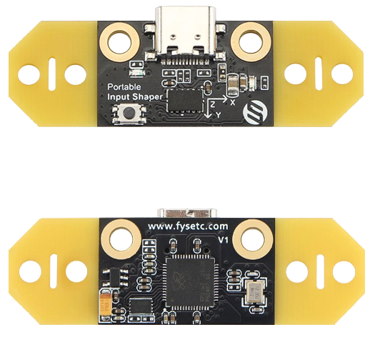

---
hide:
  - toc
---

# Configuration de l'ADXL

Klipper intégre le support de l'accéléromètre ADXL345, qui peut être utilisé pour mesurer les fréquences de résonance de l'imprimante pour différents axes, et régler automatiquement les paramètres d'entrée pour compenser les résonances. Cela permet de réduire l'ondulation (également connue sous le nom de ghosting) sur les impressions.

Ici nous allons utiliser le **Fysetc Portable Input Shaper** pour mesurer les résonances via USB. Il est pratique car ne nécessite aucune soudure et il possède également un chipset Raspbery Pi RP2040.

{ width="400" }

**Nécessaire :**

- Accéléromètre Fysetc Portable Input Shaper
- Câble USB-C vers USB (vérifiez bien le type de câble nécessaire en fonction du Raspberry Pi utilisé)
- Support STL pour Fysetc Portable Input Shaper : :material-web: <a href="https://www.printables.com/model/405796-flsun-super-racer-fysetc-portable-input-shaper-mou" target=_blank">Printables</a>

{==

:octicons-info-16: Il est nécessaire de couper les bords jaunes pour réduire la largeur.
 
==}
  
<br />
  
- Connectez-vous en SSH et vérifiez que les dépendances nécessaires au fonctionnement de l’accéléromètre sont à jour en saisissant les commandes suivantes (une commande à la fois) :

``` yaml
sudo apt update
```

``` yaml
sudo apt install python3-numpy python3-matplotlib libatlas-base-dev
```

- Suivi de cette commande pour installer **Numpy** dans l'environnement de Klipper :

``` yaml
~/klippy-env/bin/pip install -v numpy
```

- Il est également nécessaire de compiler le firmware pour l’accéléromètre, entrez les commandes suivantes (une commande à la fois) :

``` yaml
cd ~/klipper/
```
  
``` yaml
make menuconfig
```

- Déplacez-vous sur le menu avec les touches ++"Haut"++ et ++"Bas"++ de votre clavier et validez l’élément sélectionné avec la touche ++"Entrée"++ et sélectionnez ces paramètres :
  
{ width="800" }

- Saisissez les commandes suivantes pour compiler le firmware (une à la fois) :

``` yaml
make clean
```

``` yaml
make
```

- Branchez l’accéléromètre dans l'un des ports USB de votre Raspberry Pi tout en maintenant le bouton (présent sur sa face avant) enfoncé.
  
- Saisissez les commandes suivantes pour installer le firmware dans l’accéléromètre (une commande à la fois) :

``` yaml
cd ~
```

``` yaml
sudo mount /dev/sda1 /mnt
```
  
``` yaml
sudo cp /home/pi/klipper/out/klipper.uf2 /mnt/
```

- Saisissez maintenant cette commande pour récupérer le serial USB de l’accéléromètre :
  
``` yaml
ls /dev/serial/by-id/*
```

- Vous devriez voir apparaître 2 serial USB, celui de l’accéléromètre est celui avec la mention **Klipper_rp2040** :

{ width="600" }

- Rendez-vous sur l'interface Web de Mainsail via votre navigateur Web en saisissant l'adresse IP de votre Raspberry Pi.

- Rendez-vous dans l'onglet **Machine**, ouvrez le fichier **adxl345.cfg** et modifiez la section **[mcu PIS]** :
 
``` yaml title="adxl345.cfg"
[mcu PIS]
serial: XXXXX
```

En remplaçant les *XXXXX* par le serial obtenu.

``` yaml title="adxl345.cfg"
[mcu PIS]
serial: /dev/serial/by-id/usb-Klipper_rp2040_E6605481DB318D34-if00
```
  
{==

:octicons-info-16: Chaque serial est différent, il est donc normal que vous n'ayez pas exactement le même que celui ci-dessus.

==}

- Cliquez sur **SAUVEGARDER ET REDÉMARRAGE** en haut à droite pour enregistrer le fichier.

- Décommentez (supprimez le #) la ligne suivante dans le fichier **printer.cfg** pour activer la prise en charge de l’ADXL :

``` yaml title="printer.cfg"
[include adxl345.cfg]  #Activer si vous souhaitez utiliser l'ADXL (doit être désactivé après utilisation)
```

- Cliquez sur **SAUVEGARDER ET REDÉMARRAGE** en haut à droite pour enregistrer le fichier.

- Après le redémarrage du firmware, vous devriez voir le **MCU PIS** de l’accéléromètre présent.
  
{==

:octicons-info-16: Après les tests, il est préférable de désactiver l'ADXL en commentant à nouveau la ligne suivante **[include adxl345.cfg]** dans le fichier **printer.cfg**.
  
==}

<br />

Pour l'utilisation de l'ADXL vous pouvez continuer vers la section :material-arrow-right-box: [Input Shaping](../calibrations/input-shaping.md).
