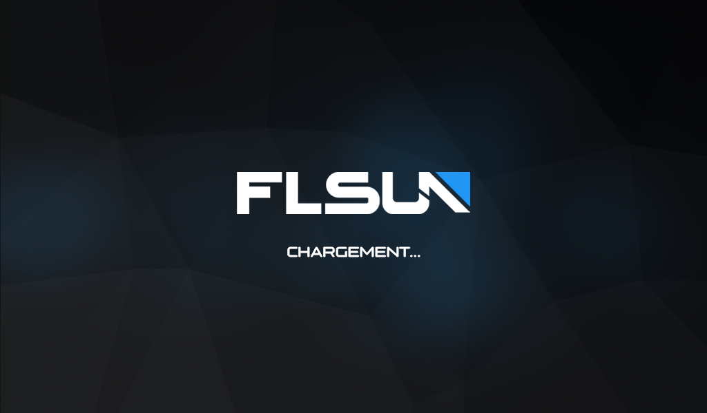
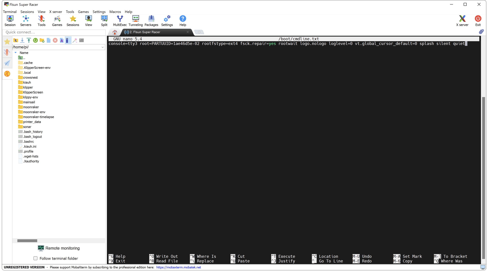
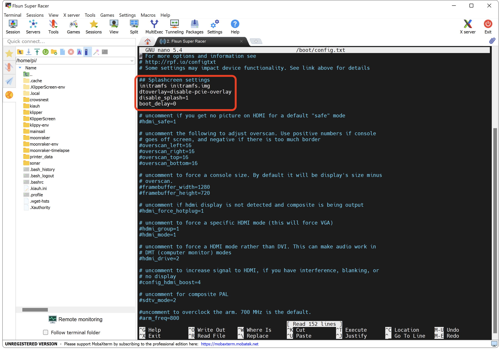
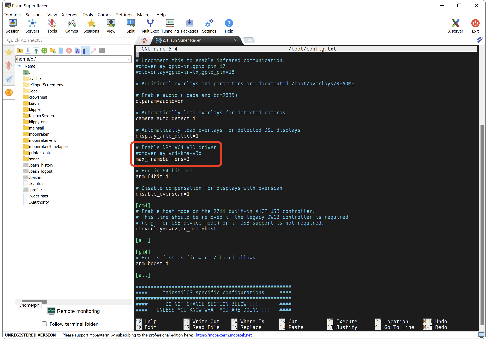

---
hide:
  - toc
---

# Configuration d'un écran avec KlipperScreen

Vous trouvez ici plusieurs STL de supports pour différents types d'écrans :

- :material-download: <a href="https://github.com/Guilouz/Klipper-Flsun-Super-Racer/raw/main/Downloads/Support_Ecran_BigTreeTech_PITFT70_by_Guilouz.7z" target="_blank">Support Ecran BigTreeTech PITFT70</a>

- :material-download: <a href="https://github.com/Guilouz/Klipper-Flsun-Super-Racer/raw/main/Downloads/Support_Ecran_Officiel_Raspberry_Pi_7_by_Guilouz.7z" target="_blank">Support Ecran Officiel Raspberry Pi 7'</a>

- :material-download: <a href="https://github.com/Guilouz/Klipper-Flsun-Super-Racer/raw/main/Downloads/Support_Ecran_Waveshare_7inch_Capacitive_Touch_Screen_LCD_(H)_by_snowjo67500.7z" target="_blank">Support Ecran Waveshare 7inch Capacitive Touch Screen LCD (H)</a>


<h2 style="color:#86be7c"><b>Installation de KlipperScreen :</b></h2>

- Connectez-vous en SSH puis saisissez les commandes suivantes pour installer ma version de **KlipperScreen** (une à la fois) :

``` yaml
cd ~ && git clone https://github.com/Guilouz/KlipperScreen-Flsun-Super-Racer.git
```

``` yaml
sudo mv /home/pi/KlipperScreen-Flsun-Super-Racer /home/pi/KlipperScreen
```

``` yaml
./KlipperScreen/scripts/KlipperScreen-install.sh
```

- Patientez le temps de l’installation, cela peut prendre plusieurs minutes.

- Saisissez ensuite la commande suivante pour redémarrer :

``` yaml
sudo reboot
```

- Rendez-vous sur l'interface Web de Mainsail via votre navigateur Web en saisissant l'adresse IP de votre Raspberry Pi.

- Ouvrez le fichier **moonraker.conf** et ajoutez ou modifiez (si déjà présente) la section **[update_manager KlipperScreen]** comme suit :

``` yaml hl_lines="4" title="moonraker.conf"
[update_manager KlipperScreen]
type: git_repo
path: /home/pi/KlipperScreen
origin: https://github.com/Guilouz/KlipperScreen-Flsun-Super-Racer.git
virtualenv: ~/.KlipperScreen-env
requirements: scripts/KlipperScreen-requirements.txt
system_dependencies: scripts/system-dependencies.json
managed_services: KlipperScreen
```

- Cela permet d’obtenir les futures mises à jour de ma version de KlipperScreen.

<br />

<h2 style="color:#86be7c"><b>Installation du logo de démarrage :</b></h2>

- Cette étape permet d'afficher un logo de démarrage à la place des textes de démarrage du Rapsberry Pi jusqu’à l’apparition du menu KlipperScreen :

{ width="600" }

- Télécharger le pack de boot en fonction de votre résolution de votre écran et dézippez-le :

    * :material-download: <a href="https://github.com/Guilouz/Klipper-Flsun-Super-Racer/raw/main/Downloads/Pack_Boot_800x480.rar" target="_blank">Pack Boot 800x480</a>
    * :material-download: <a href="https://github.com/Guilouz/Klipper-Flsun-Super-Racer/raw/main/Downloads/Pack_Boot_1024x600.rar" target="_blank">Pack Boot 1024x600</a>

- Lancez le logiciel **MobaXterm** sous Windows ou **Cyberduck** sous macOS et connectez vous.

- Faites glisser les 3 fichiers suivants dans le répertoire **/home/pi/** :

    * <p style="color:#09991c">initramfs.img</p>
    * <p style="color:#09991c">splash.txt</p>
    * <p style="color:#09991c">splash.png</p>

- Dans la fenêtre d'invite de commande SSH, entrez les commandes suivantes (une à la fois) :

``` yaml
sudo cp /home/pi/splash.png /boot/
```
  
``` yaml
sudo cp /home/pi/splash.txt /boot/
```

``` yaml
sudo cp /home/pi/initramfs.img /boot/
```

- Vous pouvez ensuite supprimer ces 3 fichiers du répertoire **/home/pi/** en saisissant les commandes suivantes (une à la fois) :

``` yaml
sudo rm /home/pi/splash.png
```

``` yaml
sudo rm /home/pi/splash.txt
```

``` yaml
sudo rm /home/pi/initramfs.img
```

- Saisissez ensuite la commande suivante :

``` yaml
sudo nano /boot/firmware/cmdline.txt
```

- Sur la fenêtre qui s'affiche, remplacez le paramètre **console=tty1** par **console=tty3** puis ajoutez ces éléments à la fin de la ligne :

``` yaml title="cmdline.txt"
logo.nologo loglevel=0 vt.global_cursor_default=0 splash silent quiet
```

{ width="600" }

- Puis sur votre clavier appuyez sur les touches ++"Ctrl"++ + ++"X"++ pour quitter, ++"Y"++ pour sauvegarder et ++"Entrée"++ pour valider.

- Saisissez ensuite la commande suivante :

``` yaml
sudo nano /boot/config.txt
```

- Sur la fenêtre qui s'affiche, ajoutez ces éléments au début du fichier :

``` yaml title="config.txt"
## Splashcreen settings
initramfs initramfs.img
disable_splash=1
boot_delay=0
```

{==

:warning: Ajoutez cette ligne en plus au début du fichier si vous utilisez un Raspberry Pi CM4.

==}

``` yaml title="config.txt"
dtoverlay=disable-pcie-overlay
```

{ width="600" }

- Puis modifiez également ces lignes déjà présentes en ajoutant un "**#**" devant **dtoverlay=vc4-fkms-v3d** comme suit :

``` yaml hl_lines="2" title="config.txt"
# Enable DRM VC4 V3D driver
#dtoverlay=vc4-kms-v3d
max_framebuffers=2
```

{ width="600" }

- Puis sur votre clavier appuyez sur les touches ++"Ctrl"++ + ++"X"++ pour quitter, ++"Y"++ pour sauvegarder et ++"Entrée"++ pour valider.

- Saisissez ensuite la commande suivante pour redémarrer :

``` yaml
sudo reboot
```

<br />

{==

:warning: Certains écrans HDMI nécessitent des paramètres spécifiques dans le fichier **/boot/config.txt** pour fonctionner.

==}

<h2 style="color:#86be7c"><b>Pour les écrans Waveshare 7inch Capacitive Touch Screen LCD (H) :</b></h2>

- Il est également nécessaire d’ajouter cela au début du fichier :

``` yaml title="config.txt"
hdmi_force_hotplug=1 
config_hdmi_boost=10
hdmi_group=2 
hdmi_mode=87 
hdmi_cvt 1024 600 60 6 0 0
```

<h2 style="color:#86be7c"><b>Pour les écrans BigTreeTech HDMI5/HDMI7 :</b></h2>

- Il est également nécessaire d’ajouter cela au début du fichier  :

``` yaml title="config.txt"
hdmi_group=2
hdmi_mode=87
hdmi_cvt 1024 600 60 6 0 0 0
hdmi_drive=1
```
