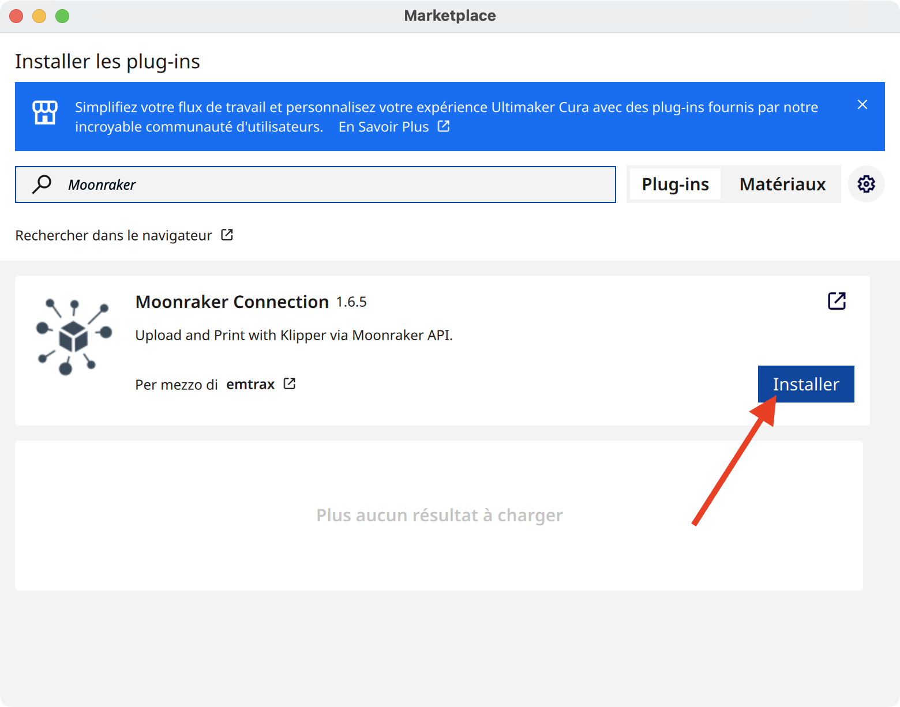
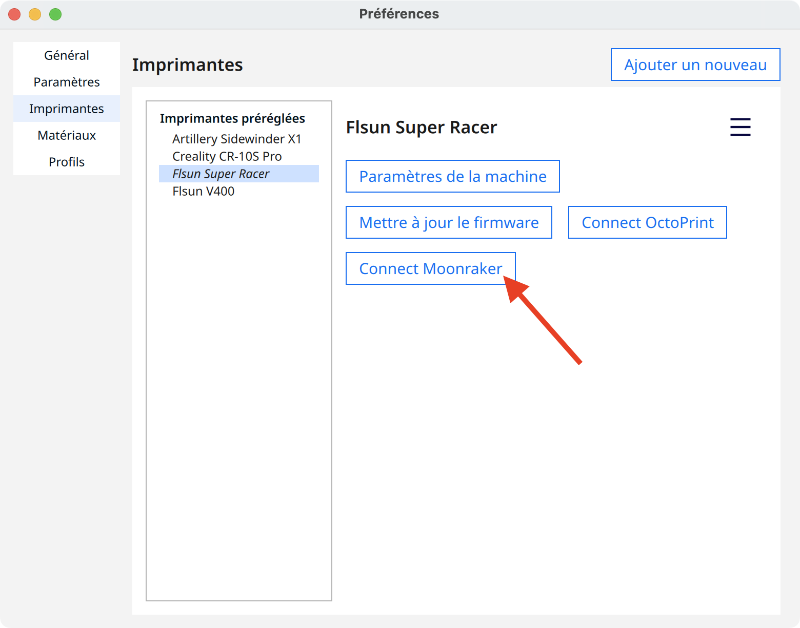
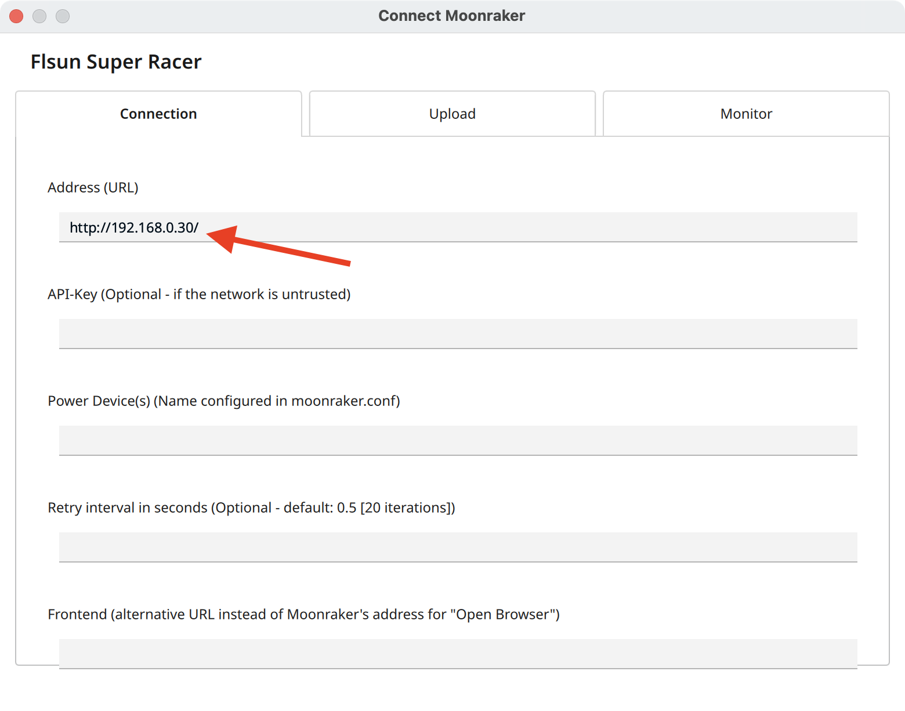
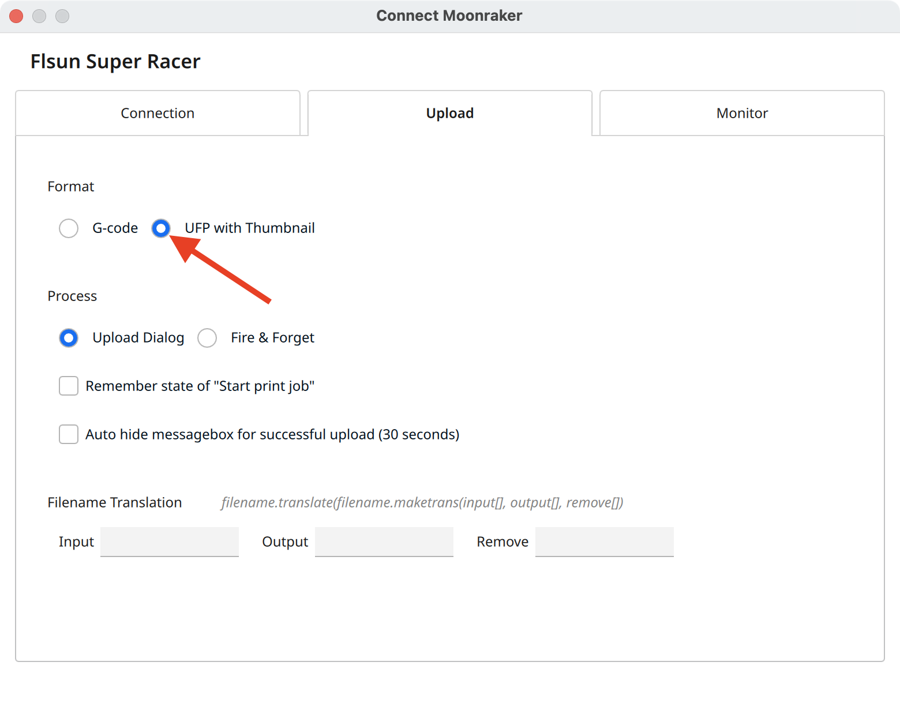
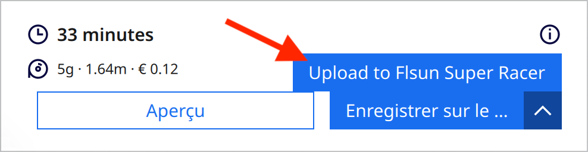
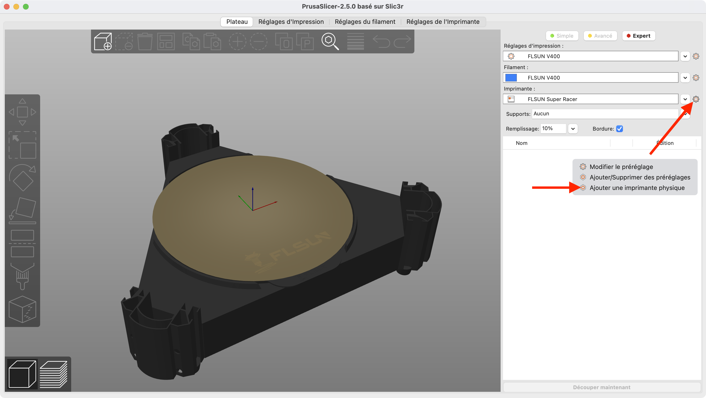
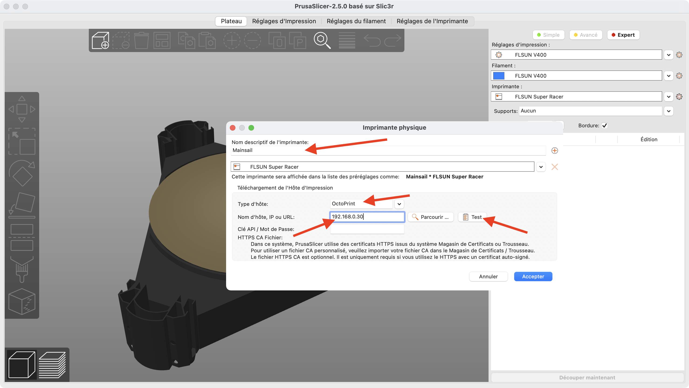
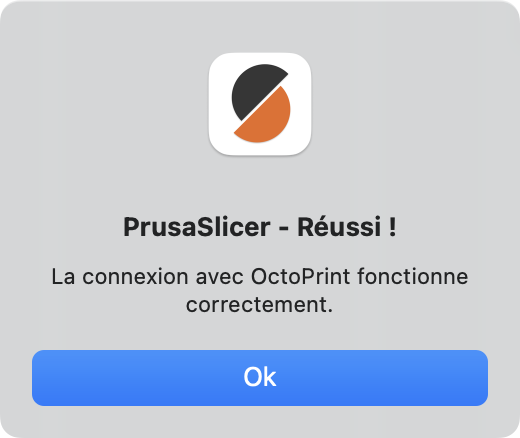
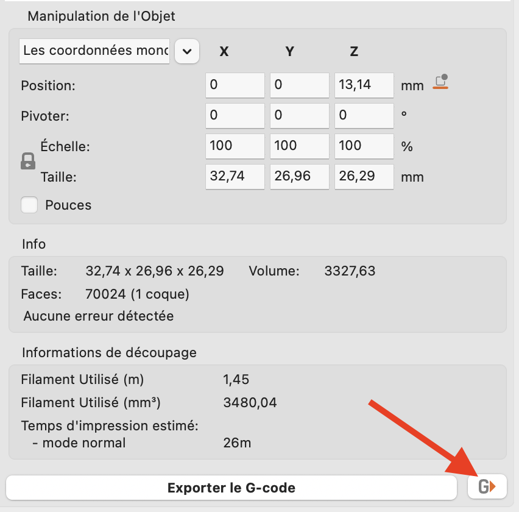
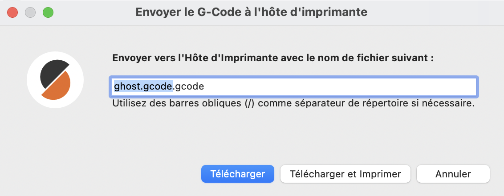

---
hide:
  - toc
---

# Envoyer un Gcode vers Mainsail

Cette fonctionnalité permet d'envoyer directement vos fichiers Gcodes vers votre Raspberry Pi.

<h2 style="color:#86be7c"><b>Pour Cura :</b></h2>

- Démarrez Cura et rendez-vous sur **Marché en ligne** puis faites une recherche du plug-in **Moonraker Connection** et cliquez sur **Installer** :

{ width="600" }

- Redémarrez Cura et rendez-vous dans les préférences de votre imprimante, un nouvel élément **Connect Moonraker** devrait être présent :

{ width="600" }

- Sur l’onglet **Connection**, renseignez l’adresse IP de votre Raspberry Pi dans le champ **Addresse (URL)** :

{ width="600" }

{==

:warning: Il est important de préciser **http://** devant votre adresse IP.

==}

- Sur l’onglet **Upload**, cochez la case **UFP with Thumbnail** :

{ width="600" }

- Une fois votre modèle slicé, une nouvelle option d’export apparaît en cliquant sur la flèche vers le bas :

{ width="400" }

- Cette fonctionnalité enverra votre fichier Gcode sur votre Raspberry Pi et il sera directement visible sur Mainsail ou KlipperScreen, prêt à être imprimé.

 

<h2 style="color:#86be7c"><b>Pour PrusaSlicer :</b></h2>

- Cliquez sur les réglages de l'imprimante puis sur **Ajouter une imprimante physique** :

{ width="600" }

- Renseignez un nom dans le champ **Nom descriptif de l'imprimante**, définissez le type d'hôte sur **Octoprint**, renseignez l'adresse IP de votre Raspberry Pi dans le champ **Nom d'hôte, IP ou URL** puis cliquez sur **Test** pour vérifier la connexion :

{ width="600" }

- Si tous les paramètres sont corrects, vous devriez obtenir ceci :

{ width="300" }

- Cliquez ensuite sur **Accepter** pour la valider la configuration.

- Une fois votre modèle slicé, une nouvelle icône d’export apparaît :

{ width="400" }

- Il suffit ensuite de valider l'envoi de votre fichier Gcode sur votre Raspberry Pi et il sera directement visible sur Mainsail ou KlipperScreen, prêt à être imprimé :

{ width="400" }

 

<h2 style="color:#86be7c"><b>Pour OrcaSlicer :</b></h2>

- Cliquez sur l'icône WiFi à côté des paramètres de l'imprimante : 

{ width="400" }

- Renseigner l'adresse IP de votre Raspberry Pi dans le champ **Nom d'hôte, IP ou URL** puis cliquez sur **Test** pour vérifier la connexion :

{ width="400" }

- Une fois votre modèle slicé, cliquez sur **Impression** en haut à droite de la fenêtre :

{ width="400" }

- Puis cliquez sur **Envoyer** pour télécharger le fichier G-code sur le Raspberry Pi ou sur **Imprimer** pour télécharger le fichier et l'imprimer directement :

{ width="300" }

 

L'installation principale est maintenant terminée, vous pouvez continuer vers les sections :

:material-arrow-right-box: [Configuration d'un écran avec KlipperScreen](../configurations/ecran-avec-klipperscreen.md) si vous possédez un écran.

:material-arrow-right-box: [Configuration de l'ADXL](../configurations/adxl.md) si vous utilisez un ADXL pour mesurer les résonances.

:material-arrow-right-box: [Configuration des NeoPixels](../configurations/neopixels.md) si vous possédez des NeoPixels.

:material-arrow-right-box: [Installation du thème Mainsail](../configurations/theme-mainsail.md) si vous désirez installer un thème pour Mainsail.

:material-arrow-right-box: [Fixer l'adresse IP du Raspberry Pi](../configurations/fixer-adresse-ip.md) si vous désirez configurer une adresse IP statique au Rapsberry Pi.
