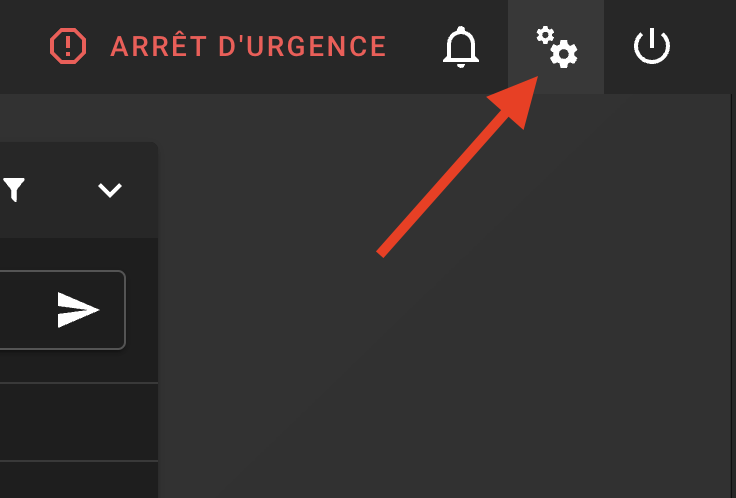
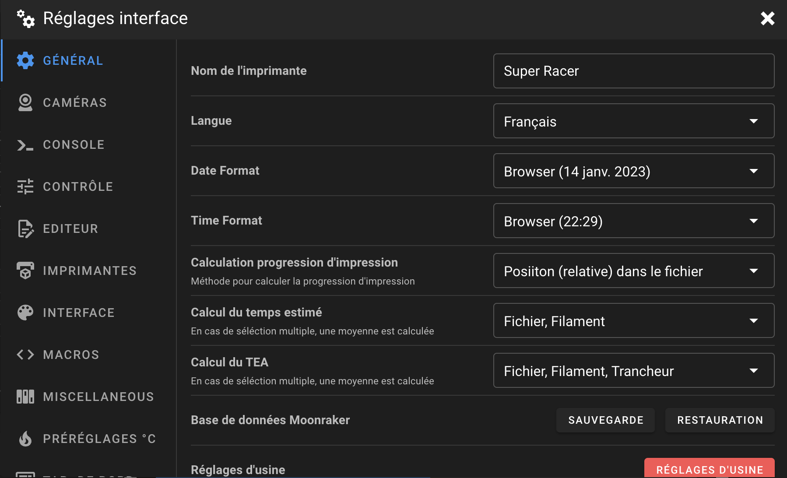
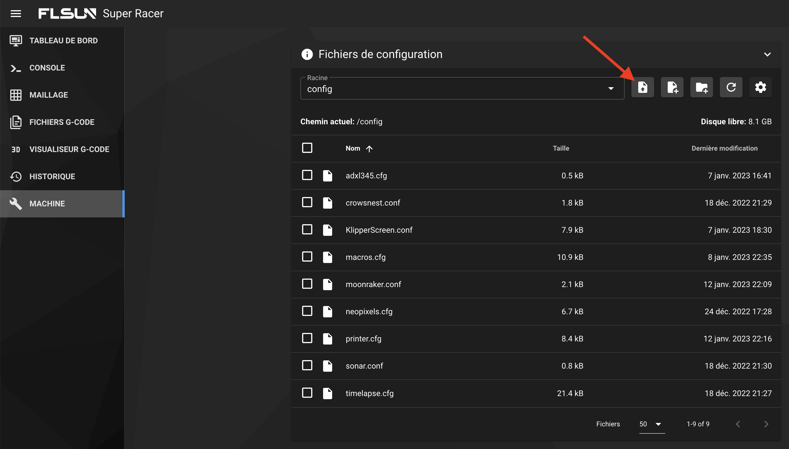
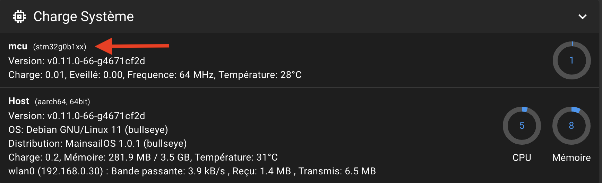
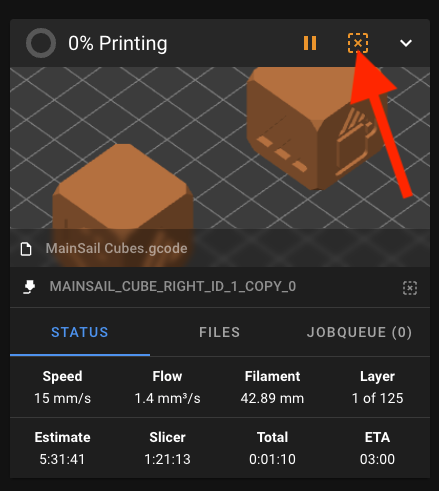
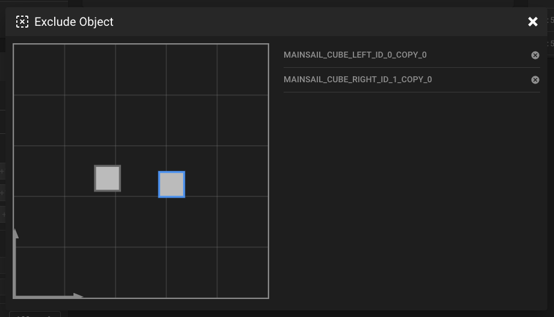

---
hide:
  - toc
---

# Installation des fichiers de configuration

Cette étape permet de mettre en place les fichiers de configurations de votre imprimante et les différentes macros.


- Téléchargez la dernière version du Pack de configuration en haut à droite du site :

{ width="400" }

- Rendez-vous sur l'interface Web de Mainsail via votre navigateur Web en saisissant l'adresse IP de votre Raspberry Pi.

- Rendez-vous dans les paramètres (roue dentée en haut à droite) :

{ width="400" }

- Puis dans l’onglet **GÉNÉRAL** définissez un nom à l’imprimante, passez la langue en Français et fermez les paramètres :

{ width="600" }

{==

:octicons-info-16: Vous pouvez passer en revue les différents paramètres et les configurer à votre convenance.

==}

- Rendez-vous dans l'onglet **Machine** sur le menu latéral gauche puis importez les fichiers suivants situés dans le dossier **Configurations** du Pack :

    * <p style="color:#09991c">KlipperScreen.conf</p>
    * <p style="color:#09991c">printer.cfg</p>
    * <p style="color:#09991c">neopixels.cfg</p>
    * <p style="color:#09991c">macros.cfg</p>
    * <p style="color:#09991c">adxl345.cfg</p>
  
{==

:octicons-info-16: Vous pouvez faire glisser les fichiers directement sur l’interface de Mainsail afin de les importer ou vous pouvez cliquer sur l’icône d’importation.

==}

{ width="600" }

- Une fois importés, ouvrez le fichier **printer.cfg** et modifiez la ligne suivante dans la section **Paramètres MCU** :

``` yaml hl_lines="6" title="printer.cfg"
########################################
# Paramètres MCU
########################################

[mcu]
serial: XXXXXX
restart_method: command
```

En remplaçant les *XXXXX* par le serial obtenu dans la section :material-arrow-right-box: [Récupération du Serial USB](../configurations/recuperation-du-serial-usb.md).

``` yaml hl_lines="6" title="printer.cfg"
########################################
# Paramètres MCU
########################################

[mcu]
serial: /dev/serial/by-id/usb-Klipper_stm32g0b1xx_2F0034001050415833323520-if00
restart_method: command
```

- Cliquez sur **SAUVEGARDER ET REDÉMARRAGE** en haut à droite pour enregistrer le fichier.

- Après le redémarrage du firmware, vous devriez voir le MCU de l'imprimante présent :

{ width="600" }

- Ouvrez ensuite le fichier **moonraker.conf** et modifiez la ligne suivante :

``` yaml hl_lines="3" title="moonraker.conf"
[file_manager]
# post processing for object cancel. Not recommended for low resource SBCs such as a Pi Zero. Default False
enable_object_processing: False
```

par

``` yaml hl_lines="3" title="moonraker.conf"
[file_manager]
# post processing for object cancel. Not recommended for low resource SBCs such as a Pi Zero. Default False
enable_object_processing: True
```

- Cela permet d’activer la fonction **Exclude Objects** qui permet d’exclure des objets individuels d’une impression en cours via ce bouton :

|  | Fonction Exclude Objects |  |
| :---------: | :---------: | :---------: |
|{ width="400" } | <br /><br /><br /><br />:material-arrow-right-bold:<br />Le bouton ouvre une boîte de dialogue dans laquelle vous pouvez sélectionner chaque objet individuel et l'exclure de l'impression en cours<br />:material-arrow-right-bold: | <br /><br /><br />{ width="400" } |

{==

:octicons-info-16: Plus d'informations sur la documentation officielle : :material-web: <a href="https://docs.mainsail.xyz/overview/features/exclude-objects" target="_blank">Exclude Objects | Mainsail</a>

==}

- Toujours sur le fichier **moonraker.conf**, supprimez ensuite les lignes suivantes :

``` yaml title="moonraker.conf"
[update_manager mainsail-config]
type: git_repo
primary_branch: master
path: ~/mainsail-config
origin: https://github.com/mainsail-crew/mainsail-config.git
managed_services: klipper
```

- Cliquez sur **SAUVEGARDER ET REDÉMARRAGE** en haut à droite pour enregistrer le fichier.

- Redémarrez ensuite votre Raspberry Pi.

<br />

Vous pouvez ensuite continuer vers la section :material-arrow-right-box: [Changement du GCode de Début / Fin coté Slicers](../configurations/gcode-de-debut-fin.md).
