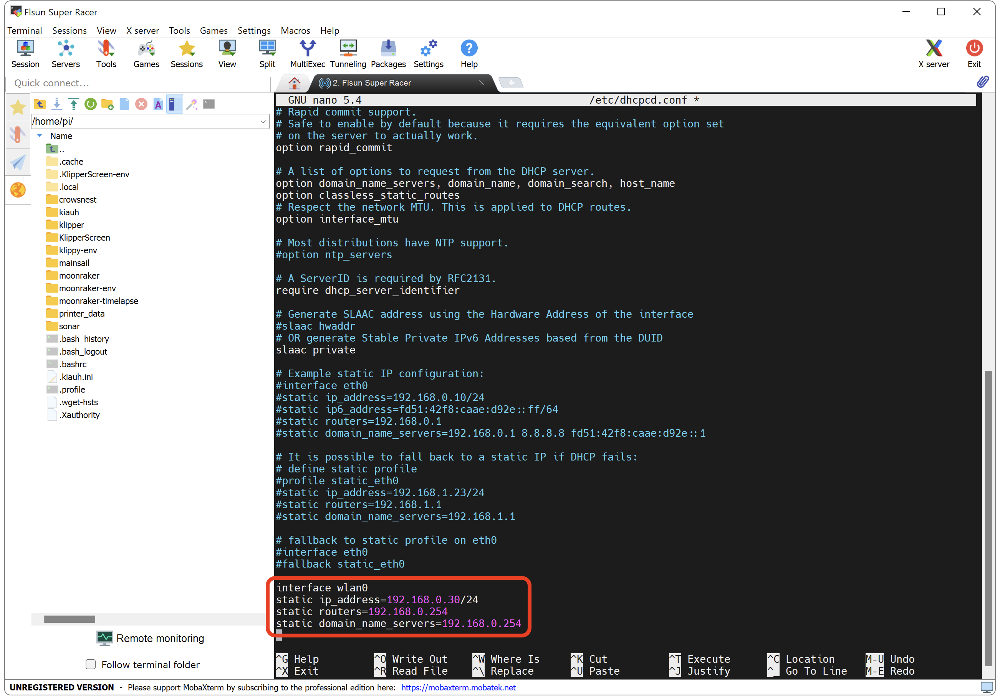

---
hide:
  - toc
---

# Fixer l'adresse IP du Raspberry Pi

Afin d'éviter que votre Raspberry Pi ne change d'adresse IP à chaque démarrage, il est possible de lui définir une adresse IP statique.

{==

:octicons-info-16: Il est également possible de fixer l'adresse IP via un bail DHCP statique dans les paramètres de votre routeur.

==}

- Connectez-vous en SSH puis saisissez la commande suivante :

``` yaml
sudo nano /etc/dhcpcd.conf
```

- Descendez jusqu'à la fin du fichier et copiez ces lignes :

{==

:warning: Remplacer les **XXX.XXX.XXX.XXX** par les adresses IP correspondantes.

==}

### Si vous êtes connecté en Ethernet :

``` yaml title="dhcpcd.conf"
interface eth0
static ip_address=XXX.XXX.XXX.XXX/24
static routers=XXX.XXX.XXX.XXX
static domain_name_servers=XXX.XXX.XXX.XXX
```

{ width="600" }

### Si vous êtes connecté en WiFi :

``` yaml title="dhcpcd.conf"
interface wlan0
static ip_address=XXX.XXX.XXX.XXX/24
static routers=XXX.XXX.XXX.XXX
static domain_name_servers=XXX.XXX.XXX.XXX
```

{ width="600" }

- Puis sur votre clavier appuyez sur les touches ++"Ctrl"++ + ++"X"++ pour quitter, ++"Y"++ pour sauvegarder et ++"Entrée"++ pour valider.

- Saisissez ensuite la commande suivante pour redémarrer :

``` yaml
sudo reboot
```

<br />
