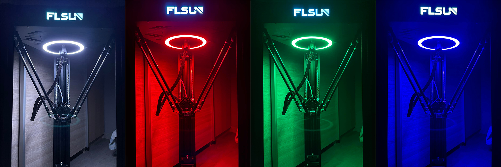
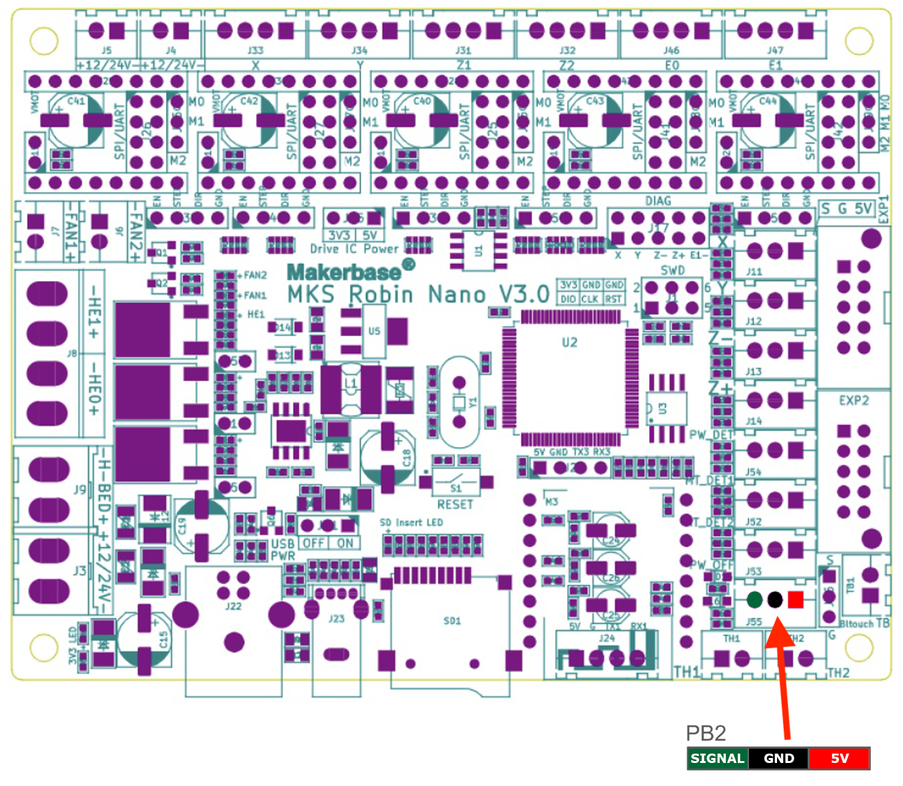
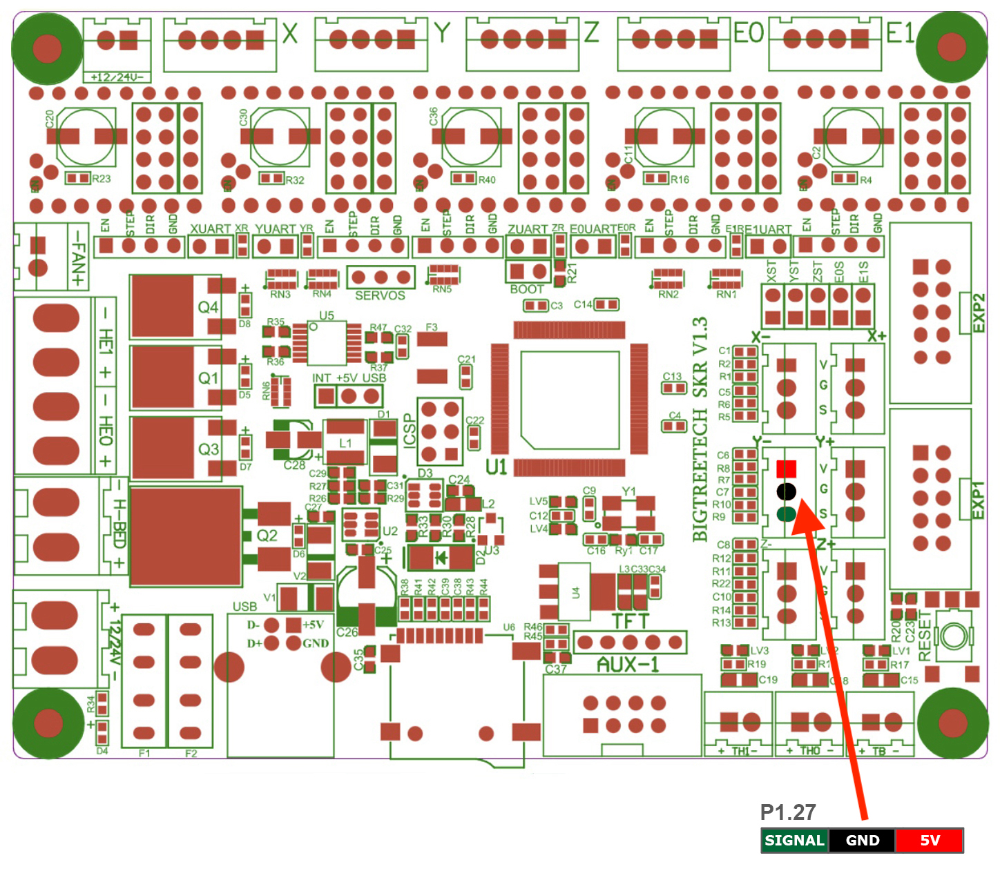
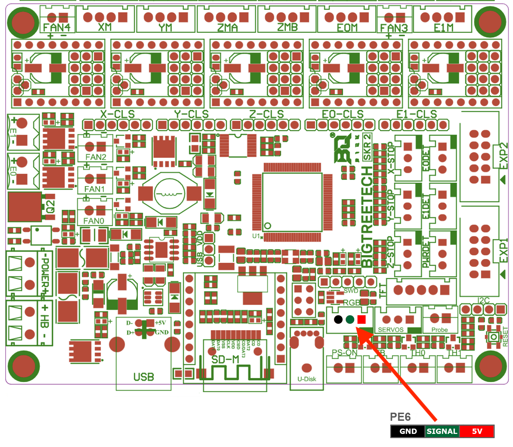
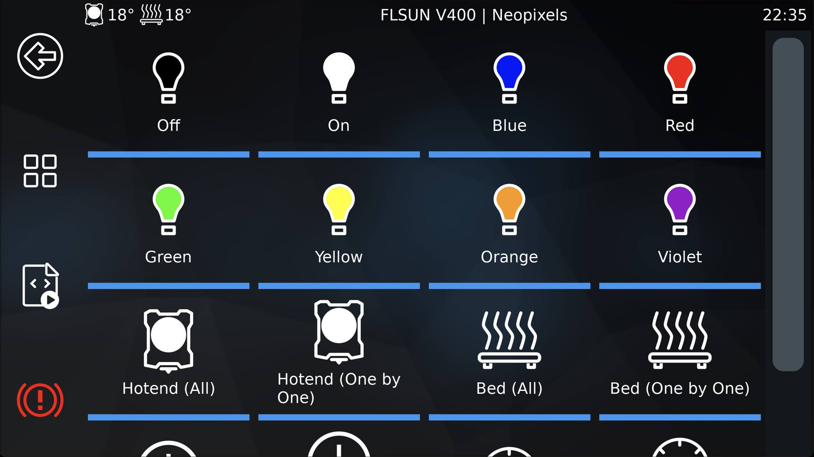

---
hide:
  - toc
---

# Configuration des NeoPixels

{ width="100%" }

- Vous pouvez retrouver mon support NeoPixels Ring Light ici : :material-web: <a href="https://www.printables.com/model/272995-flsun-neopixels-ring-light-support" target="_blank">Printables</a>

- Il est important d’utiliser des LED **5V WS2812B** car elles sont pilotables.

<h2 style="color:#86be7c"><b>Câblage sur les cartes mères MKS Robin Nano V3.0/V3.1 :</b></h2>

{ width="600" }

<h2 style="color:#86be7c"><b>Câblage sur les cartes mères BigTreeTech SKR 1.3 :</b></h2>

{ width="600" }

<h2 style="color:#86be7c"><b>Câblage sur les cartes mères BigTreeTech SKR 2.0 :</b></h2>

{ width="600" }

- Rendez-vous sur l'interface Web de Mainsail via votre navigateur Web en saisissant l'adresse IP de votre Raspberry Pi.

- Rendez-vous dans l'onglet **Machine** puis remplacez le fichier **KlipperScreen.conf** par celui présent dans le dossier **NeoPixels** du Pack.

	Cela permet d’avoir un nouveau menu de gestion des NeoPixels sur l’écran de KlipperScreen :

{ width="600" }

- Ouvrez ensuite le fichier **printer.cfg** et décommentez (supprimez le #) les lignes suivantes pour activer la prise en charge des NeoPixels :

``` yaml title="printer.cfg"
#[neopixel NeoPixels]
#pin: PB2
#chain_count: 34
#color_order: GRB
#initial_RED: 1.0
#initial_GREEN: 1.0
#initial_BLUE: 1.0
```

- Si vous désirez également activer les macros pour piloter les NeoPixels, décommentez (supprimez le #) la ligne suivante :

``` yaml title="printer.cfg"
[include neopixels.cfg] #Activer si vous souhaitez utiliser les NeoPixels
```

- Vous pouvez également modifier le nombre de LED de vos NeoPixels dans la section **Paramètres Neopixels** à la ligne **chain_count: 34** :

``` yaml hl_lines="7" title="printer.cfg"
########################################
# Paramètres Neopixels
########################################

[neopixel NeoPixels]
pin: PD0
chain_count: 34
color_order: GRB
initial_GREEN: 0.0
initial_RED: 0.0
initial_BLUE: 0.0
```

- Cliquez sur **SAUVEGARDER ET REDÉMARRAGE** en haut à droite pour enregistrer le fichier.

- Les NeoPixels peuvent être pilotées via ces macros ou depuis l’écran via le menu **NeoPixels** :

    * **NEOPIXEL_ON** :octicons-arrow-right-24: Allumer les NeoPixels
    * **NEOPIXEL_OFF** :octicons-arrow-right-24: Éteindre les NeoPixels
    * **NEOPIXEL_BLUE** :octicons-arrow-right-24: Allumer les NeoPixels en bleu
    * **NEOPIXEL_RED** :octicons-arrow-right-24: Allumer les NeoPixels en rouge
    * **NEOPIXEL_GREEN** :octicons-arrow-right-24: Allumer les NeoPixels en vert
    * **NEOPIXEL_YELLOW** :octicons-arrow-right-24: Allumer les NeoPixels en jaune
    * **NEOPIXEL_ORANGE** :octicons-arrow-right-24: Allumer les NeoPixels en orange
    * **NEOPIXEL_VIOLET** :octicons-arrow-right-24: Allumer les NeoPixels en violet
    * **HOTEND_GLOW** :octicons-arrow-right-24: Allumer toutes les NeoPixels en fonction de la température de la buse
    * **HOTEND_PROGRESS** :octicons-arrow-right-24: Allumer les NeoPixels une à une en fonction de la température de la buse
    * **BED_GLOW** :octicons-arrow-right-24: Allumer toutes les NeoPixels en fonction de la température du plateau
    * **BED_PROGRESS** :octicons-arrow-right-24: Allumer les NeoPixels une à une en fonction de la température du plateau
    * **PERCENT_GLOW** :octicons-arrow-right-24: Allumer toutes les NeoPixels en fonction de la progression d'impression
    * **PERCENT_PROGRESS** :octicons-arrow-right-24: Allumer les NeoPixels une à une en fonction de la progression d'impression
    * **SPEED_GLOW** :octicons-arrow-right-24: Allumer toutes les NeoPixels en fonction de la vitesse d'impression
    * **SPEED_PROGRESS** :octicons-arrow-right-24: Allumer les NeoPixels une à une en fonction de la vitesse d'impression
