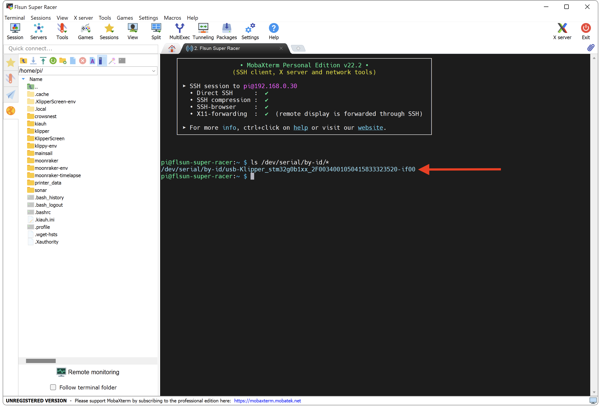

---
hide:
  - toc
---

# Récupération du Serial USB

Cette étape permet de récupérer le serial USB de la carte mère afin que Klipper puisque communiquer avec votre imprimante.


- Assurez-vous que votre imprimante est connectée sur l’un des ports USB du Raspberry Pi.

- Connectez-vous en SSH puis saisissez la commande suivante afin de récupérer le serial USB et s’assurer que l’imprimante communique bien avec votre Raspberry Pi :

``` yaml
ls /dev/serial/by-id/*
```

- Copiez la ligne qui s'affiche (dans un fichier texte par exemple), elle nous sera utile plus tard :

{ width="600" }

{==

:octicons-info-16: Chaque serial est différent, il est donc normal que vous n'ayez pas exactement le même que celui de l'illustration.

==}

<br />

<br />

{==

:warning: Si vous rencontrez le message **No such file or directory** lors de la tentative de récupération du serial USB, plusieurs éléments sont alors à vérifier.

==}

- Assurez-vous que l'imprimante est allumée.

- Vérifiez le branchement du câble USB de votre imprimante à votre Raspberry Pi, si nécessaire utilisez un autre câble USB.

- Assurez-vous que le firmware Klipper de l'imprimante a été correctement flashé.

- Vérifiez la version du Kernel de votre Raspberry Pi. Pour cela saisissez la commande suivante :

``` yaml
uname -a
```

- Vous devriez obetenir une ligne telle que : **Linux raspberrypi xxxxxx** où les xxxxxx représentent la version du Kernel.

- Si vous possédez la version **6.1.25-V8+**, cette version rencontre actuellement un bogue connu qui peut empêcher l'affichage via l'identifiant by-id. Pour corriger cela, saisissez les commandes suivantes (une à la fois) :

``` yaml
sudo su
```

``` yaml
sed -i '/^SUBSYSTEMS=="pci", ENV{ID_BUS}="pci".*/i SUBSYSTEMS=="usb", IMPORT{builtin}="usb_id", IMPORT{builtin}="hwdb --subsystem=usb"' /lib/udev/rules.d/60-serial.rules
```

``` yaml
sed -i 's/^SUBSYSTEMS=="pci", ENV{ID_BUS}="pci".*/SUBSYSTEMS=="pci", ENV{ID_BUS}=="", ENV{ID_BUS}="pci", \\\
  ENV{ID_VENDOR_ID}="$attr{vendor}", ENV{ID_MODEL_ID}="$attr{device}", \\\
  IMPORT{builtin}="hwdb --subsystem=pci"/g' /lib/udev/rules.d/60-serial.rules
```

``` yaml
sed -i '/ENV{MODALIAS}==".*/d' /lib/udev/rules.d/60-serial.rules
```

``` yaml
sudo reboot
```

- Après le redémarrage vous devriez pouvoir récupérer le serial via la commande :

``` yaml
ls /dev/serial/by-id/*
```

- Si cela ne fonctionne toujours pas, vous pouvez alors utiliser la commande suivante :

``` yaml
ls /dev/serial/by-path/*
```

<br />

Vous pouvez ensuite continuer vers la section :material-arrow-right-box: [Installation des fichiers de configuration](../configurations/fichiers-de-configuration.md).
