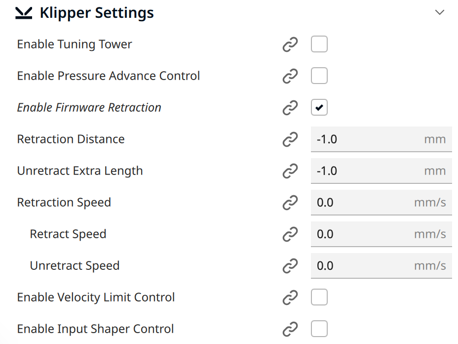
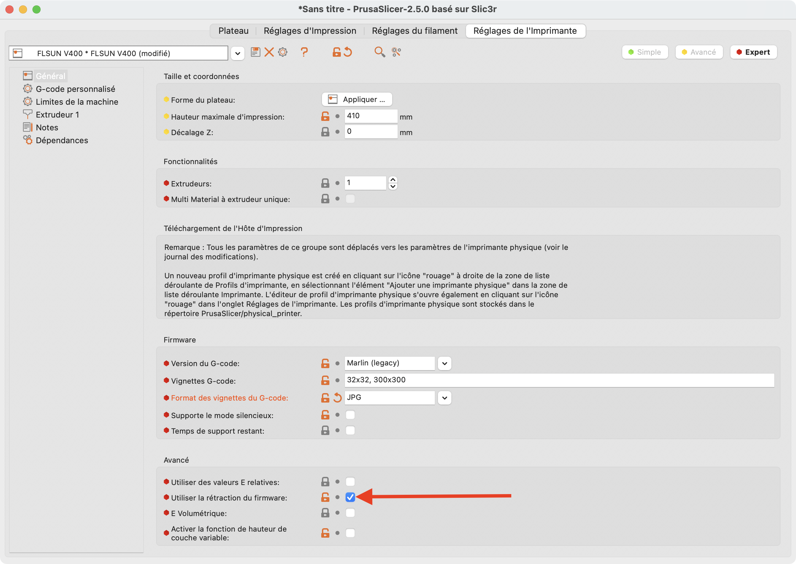

---
hide:
  - toc
---

# Utilisation de la Rétraction Firmware

La Rétraction Firmware donne un avantage comparé à la rétraction Slicer, elle peut être modifiée pendant une impression (depuis Mainsail ou KlipperScreen). 

Un même modèle peut donc être imprimé avec des paramètres de rétraction différents sans nécessité d'être reslicé.

<h2 style="color:#86be7c"><b>Pour Cura :</b></h2>

- Il est nécessaire d'installer le plugin **Klipper Settings Plugin** disponible dans le Pack (sources : :simple-github: <a href="https://github.com/jjgraphix/KlipperSettingsPlugin" target="_blank">Github</a>).

- Démarrez Cura et allez dans l'onglet **Aide** -> **Afficher le dossier de configuration**.

-	Copiez le dossier **KlipperSettingsPlugin** du Pack (présent dans le dossier Slicers/Cura) dans le dossier **plugins**.

-	Quittez Cura et redémarrez-le.

-	Activez le paramètre **Enable Firmware Retraction** comme cela sans renseigner de valeur :

{ width="400" }

<h2 style="color:#86be7c"><b>Pour PrusaSlicer :</b></h2>

- Il est juste nécessaire d'activer le paramètre **Utiliser la rétraction du firmware** depuis l’onglet **Réglages de l’imprimante** --> **Général** comme cela :

{ width="600" }

 

Vous pouvez ensuite continuer vers la section :material-arrow-right-box: [Envoyer un Gcode vers Mainsail](../configurations/envoi-gcode-mainsail.md).
