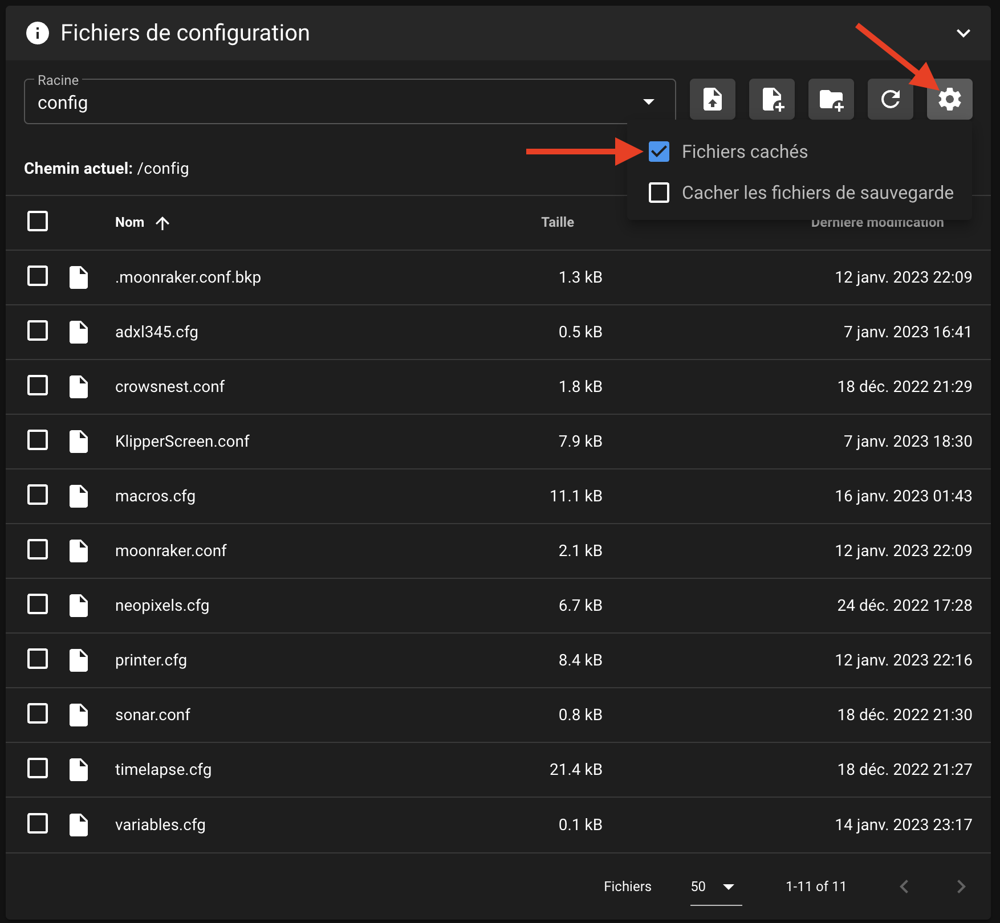
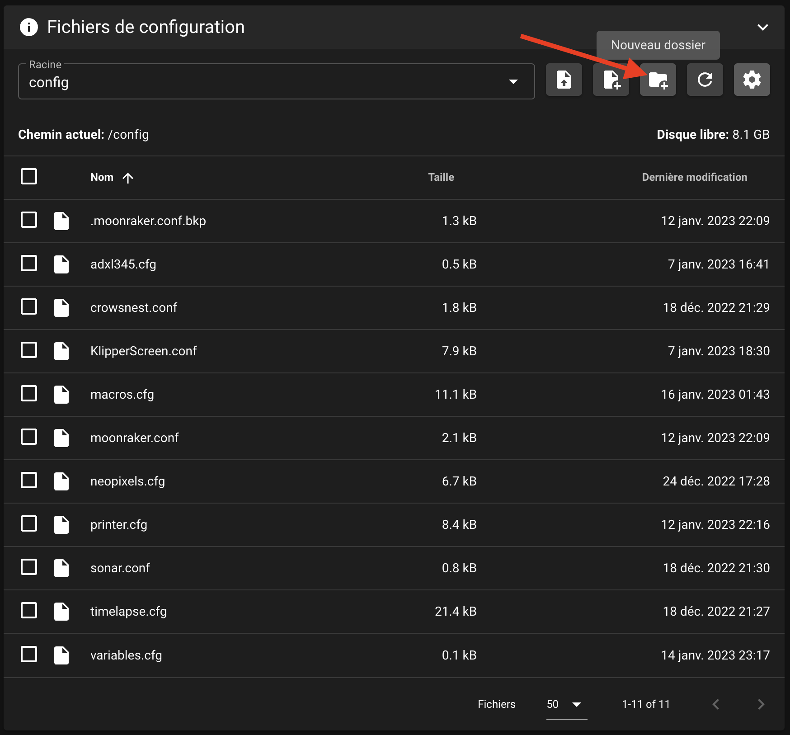
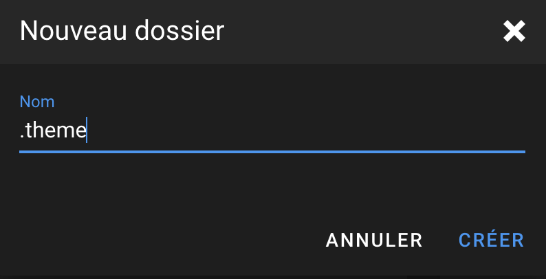
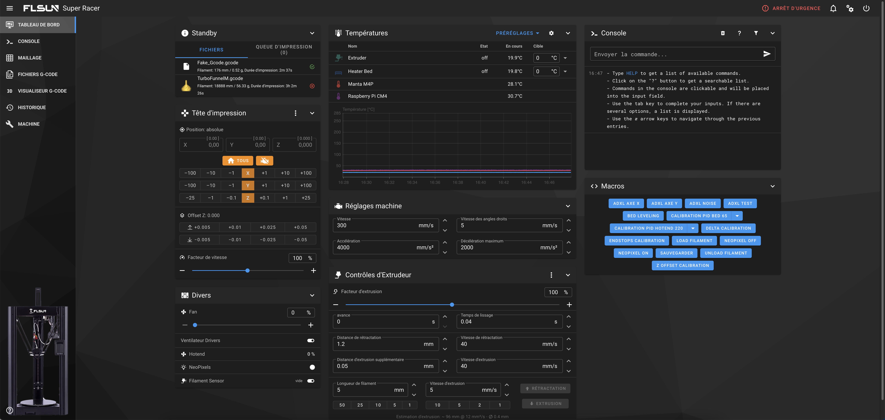

---
hide:
  - toc
---

# Installation du thème Mainsail

Il est possible de customiser l’interface de Mainsail en changeant certains éléments.

Vous trouverez plus d'informations sur la documentation officelle : :material-web: <a href="https://docs.mainsail.xyz/features/theming" target="_blank">Theming | Mainsail</a>

- Téléchargez et dézippez le pack du thème : :material-download: <a href="https://github.com/Guilouz/Klipper-Flsun-Super-Racer/raw/main/Downloads/Theme_Mainsail.rar" target="_blank">Thème Mainsail</a>

{==

:octicons-info-16: Il comprend un arrière-plan, une barre de navigation à l’effigie de la Super Racer et un logo FLSUN.

==}

- Pour installer ce thème, rendez-vous sur l'interface Web de Mainsail via votre navigateur Web en saisissant l'adresse IP de votre Raspberry Pi.

- Rendez-vous dans l'onglet **Machine** puis cliquez sur l’icône **Paramètres** et cochez la case **Fichiers cachés** :

{ width="600" }

- Cliquez ensuite sur l’icône **Nouveau dossier** :

{ width="600" }

- Nommez ce dossier **.theme** et cliquez sur **CRÉER** :

{ width="400" }

- Importez ensuite les fichiers suivants dans le dossier **.theme** :

    * 
main-background.png

    * 
sidebar-background.png

    * 
sidebar-logo.png

- Afin d’obtenir ceci :

{ width="600" }
