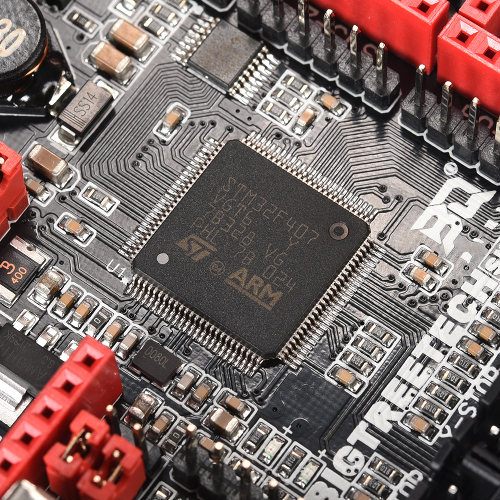
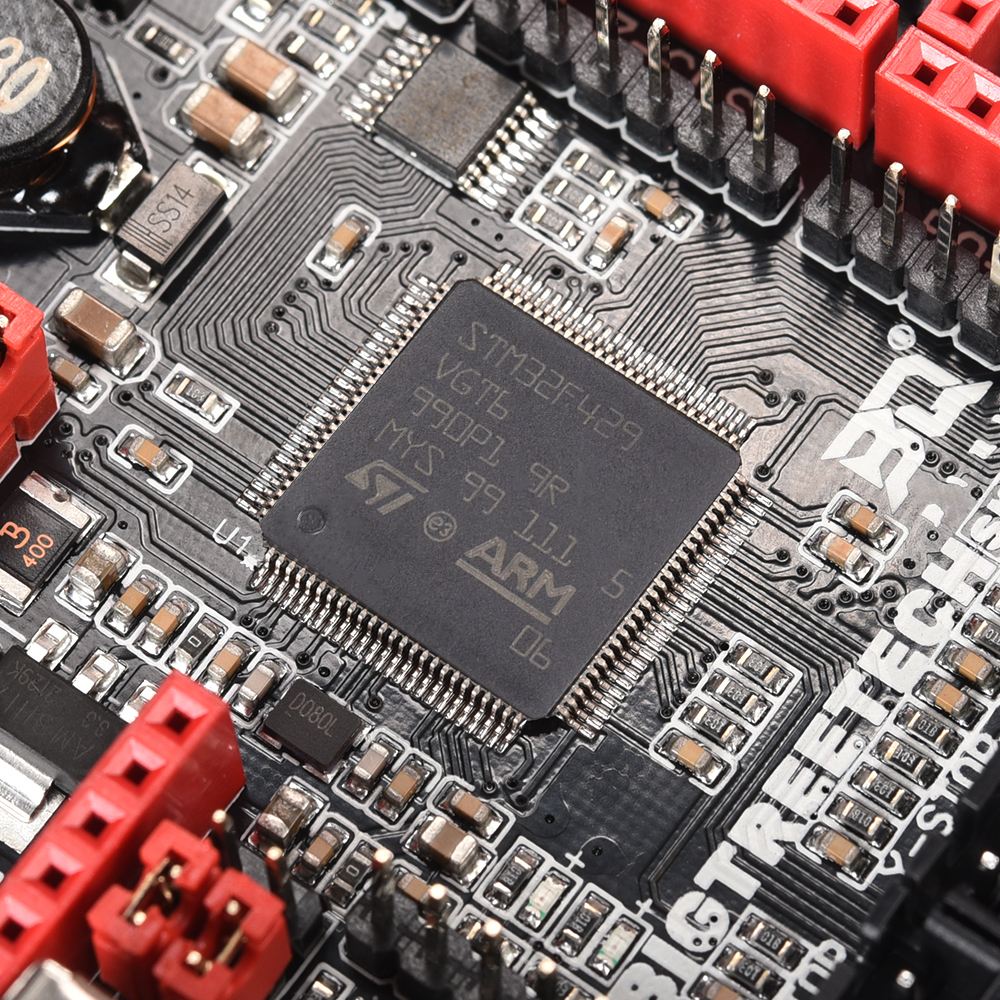
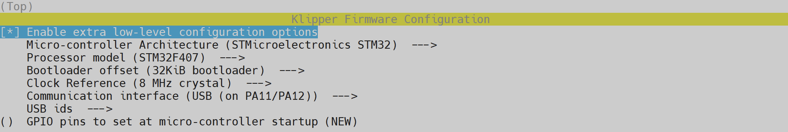

---
hide:
  - toc
---

# Compilation du firmware pour BigTreeTech SKR 2.0

:warning: Il existe deux révisions de carte mères BigTreetech SKR 2.0, l'une avec un processeur **SMT32F407** appelée **Rev A** et l'autre avec un processeur **SMT32F429** appelée **Rev B**  :

| SMT32F407 (Rev A)   | SMT32F429 (Rev B)                           |
| :---------: | :----------------------------------: |
| { width="400" }   | { width="400" }  |


- Connectez-vous en SSH et saisissez ces commandes (une à la fois) :

``` yaml
cd ~/klipper/
```
``` yaml
make menuconfig
```

- Déplacez-vous sur le menu avec les touches ++"Haut"++ et ++"Bas"++ de votre clavier et validez l’élément sélectionné avec la touche ++"Entrée"++ et sélectionnez ces paramètres :
  
    * Pour les cartes mères **BigTreeTech SKR 2.0 Rev A** (STM32F407) :

    { width="800" }
    
    * Pour les cartes mères **BigTreeTech SKR 2.0 Rev B** (STM32F429) :

    { width="800" }

- Puis sur votre clavier appuyez sur la touche ++"Q"++ puis sur ++"Y"++ pour sauvegarder la configuration.

- Saisissez les commandes suivantes pour compiler le firmware (une à la fois) :

``` yaml
make clean
```
``` yaml
make
```

- Le firmware est maintenant compilé.

<br />

Vous pouvez ensuite continuer vers la section :material-arrow-right-box: [Installation du firmware sur BigTreeTech SKR 2.0](../firmwares/installation-btt-skr2.0.md).
