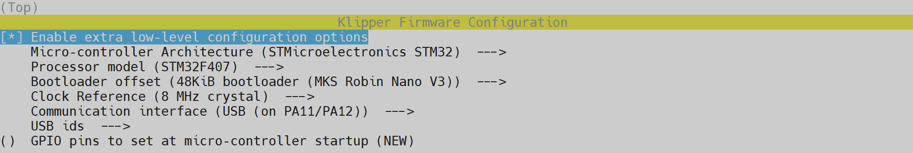

---
hide:
  - toc
---

# Compilation du firmware pour MKS Robin Nano V3.0/V3.1

- Connectez-vous en SSH et saisissez ces commandes (une à la fois) :

``` yaml
cd ~/klipper/
```
``` yaml
make menuconfig
```

- Déplacez-vous sur le menu avec les touches ++"Haut"++ et ++"Bas"++ de votre clavier et validez l’élément sélectionné avec la touche ++"Entrée"++ et sélectionnez ces paramètres :

{ width="800" }

- Puis sur votre clavier appuyez sur la touche ++"Q"++ puis sur ++"Y"++ pour sauvegarder la configuration.

- Saisissez les commandes suivantes pour compiler le firmware (une à la fois) :

``` yaml
make clean
```
``` yaml
make
```

- Le firmware est maintenant compilé.

<br />

Vous pouvez ensuite continuer vers la section :material-arrow-right-box: [Installation du firmware sur MKS Robin Nano V3.0/V3.1](../firmwares/installation-mks-robin-nano.md).
