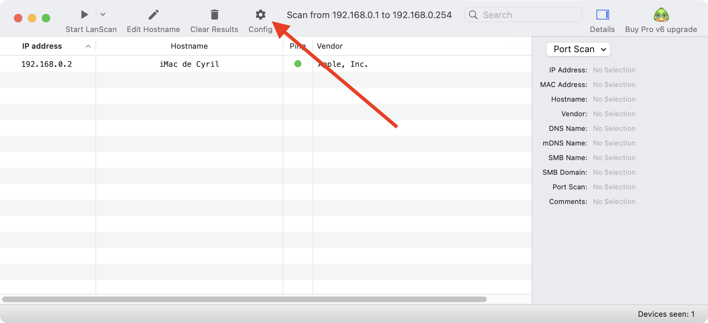
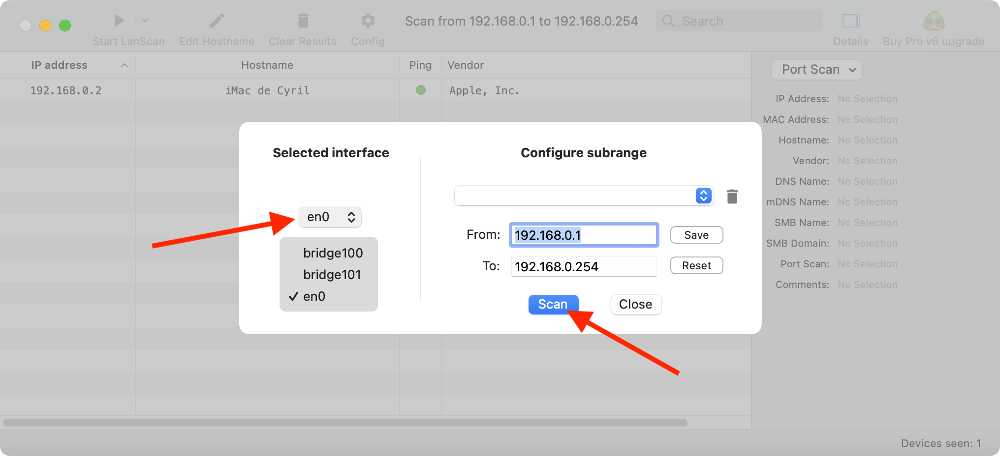
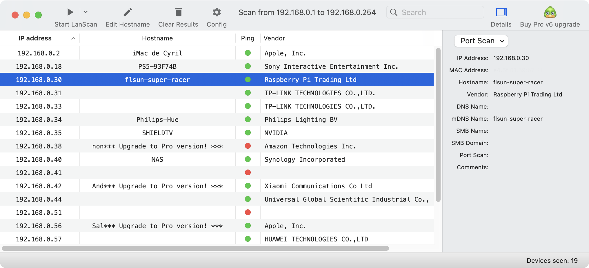
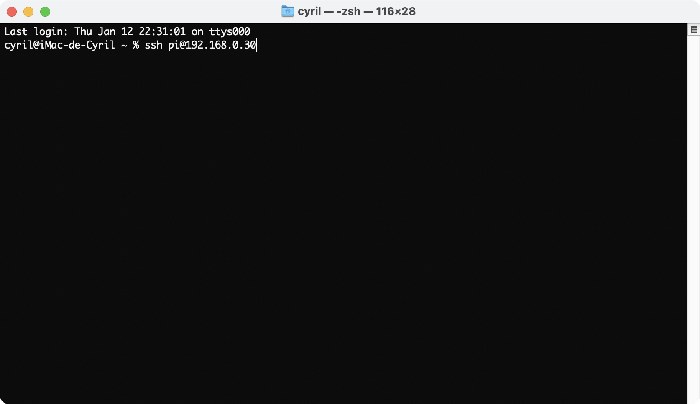
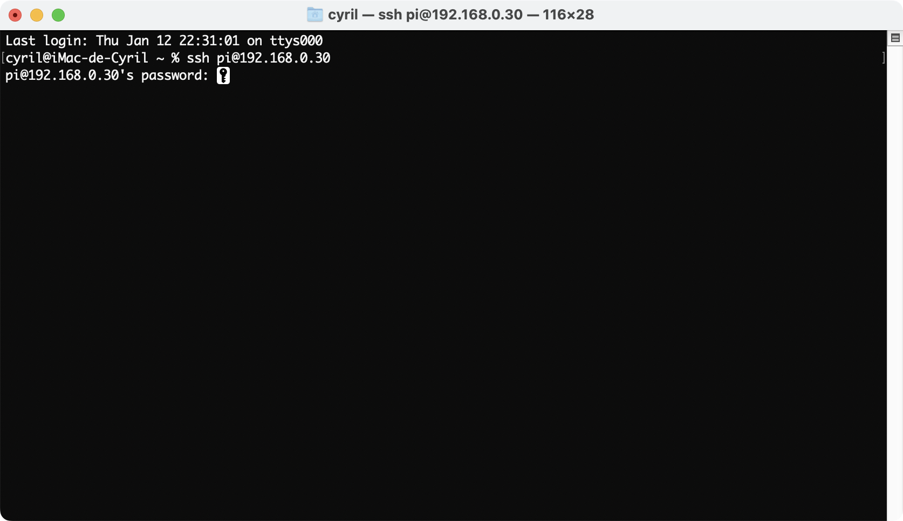
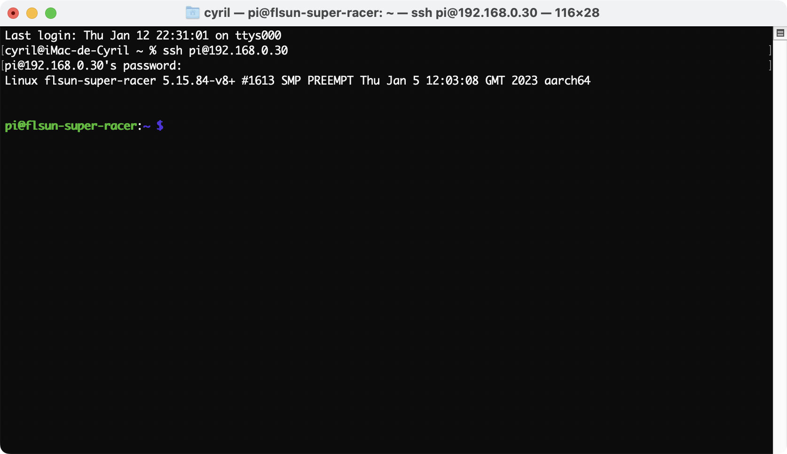
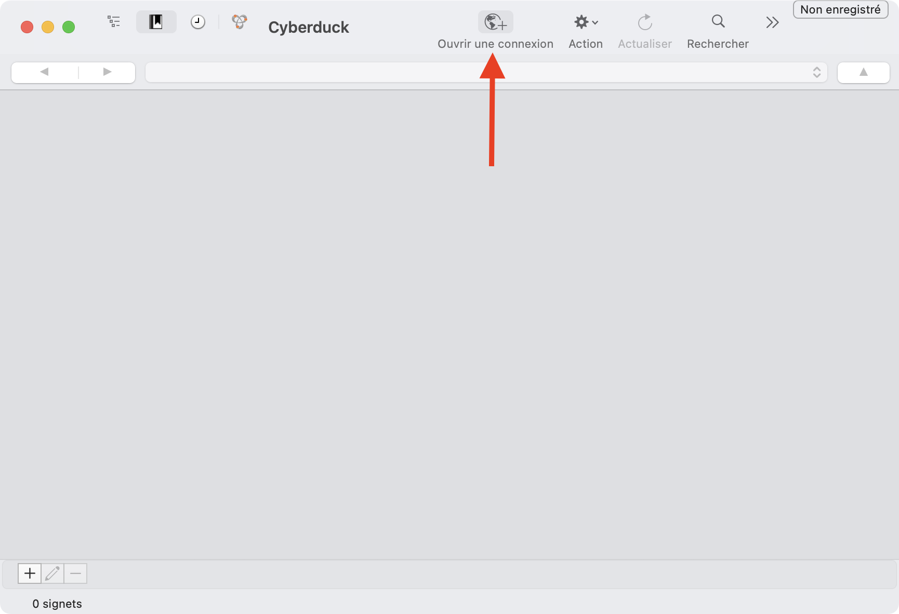
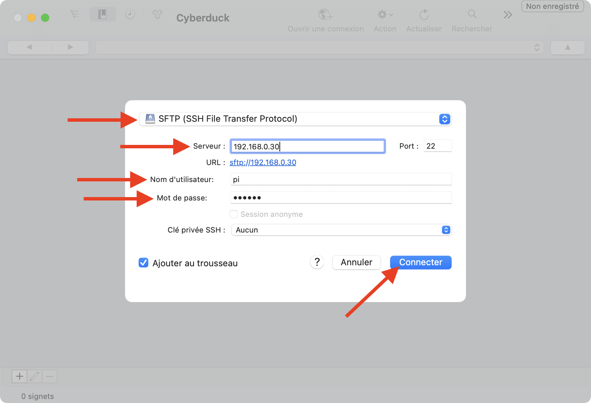
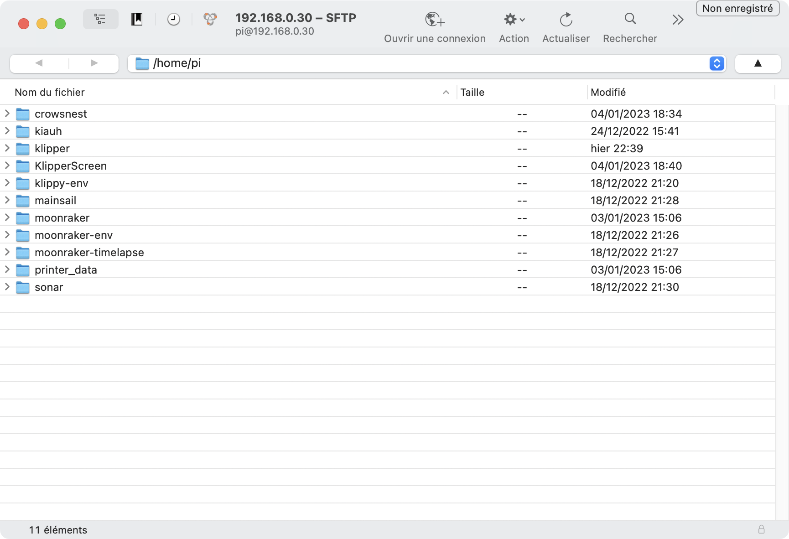

---
hide:
  - toc
---

# Connexion SSH sous MacOS

La connexion via SSH permet de pouvoir envoyer des commandes de tous types au Raspberry Pi.


- Afin d’obtenir l’adresse IP de votre Raspberry Pi sur votre réseau, téléchargez : :simple-apple: <a href="https://apps.apple.com/fr/app/lanscan/id472226235?mt=12" target="_blank">LanScan</a>

- Lancez l'application et cliquez sur **Config** :

{ width="600" }

- Sélectionnez la bonne interface réseau utilisée par votre MAC dans la partie **Select interface** puis cliquez sur **Scan** :

{ width="600" }

- Récupérez ensuite l’adresse IP correspondante à votre Raspberry Pi (il porte le même nom que le nom d’hôte renseigné dans **Raspberry Pi Imager**) :

{ width="600" }

- Lancez ensuite l'application **Terminal** et saisissez la commande suivante :

``` yaml
ssh pi@adresse_ip_du_raspberry
```

{==

:warning: Remplacez le champ **adresse_ip_du_raspberry** par l'adresse IP obtenue précédemment.

==}

{ width="600" }

- Puis saisissez votre mot de passe précédemment défini dans **Raspberry Pi Imager** (il ne s'affiche pas à la saisie, cela est normal) :

{ width="600" }

- Vous êtes désormais connecté via SSH pour envoyer des commandes au Raspberry Pi :

{ width="600" }

<br />

- Afin d’accéder aux dossiers et fichers de votre Raspberry Pi, vous pouvez téléchargez : :simple-apple: <a href="https://apps.apple.com/fr/app/cyberduck/id409222199?mt=12" target="_blank">Cyberduck</a>

- Lancez l'application puis cliquez sur **Ouvrir une connexion** :

{ width="600" }

- Renseignez les éléments suivants puis cliquez sur **Connecter** :

  - <u>Type de connexion</u> : SFTP (SSH File Transfert Protocol)
  - <u>Serveur</u> : Adresse IP de votre Raspberry Pi
  - <u>Nom d'utilisateur</u> : pi
  - <u>Mot de passe</u> : Votre mot de passe

{ width="600" }

- Vous êtes désormais connecté via SFTP pour gérer vos dossiers et fichiers :

{ width="600" }

<br />

Vous pouvez ensuite continuer vers la section :material-arrow-right-box: [Installation des dépendances](../dependances.md).
